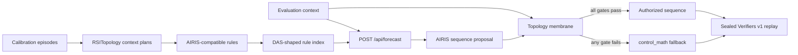

# AIRIS/DAS Hybrid Sequencer Integration

## Objective

Connect the hybrid TRM/LDT sequencer to the AIRIS rule and DAS-shaped service implemented in
`C:\projects\metta-storyworld\metta-etc` without transferring typed execution authority to confidence scoring.
AIRIS supplies an interpretable sequence proposal. DAS supplies persistence, indexing, and forecast retrieval.
The existing RSITopology controller remains the final authority.

AIRIS describes its approach as causality-oriented symbolic rule learning over a dynamic world model. The local
implementation exposes compatible rule, query, forecast, and counterexample shapes, but currently reports
`backend_mode=in_memory_das_shaped`. The native `das`, `das_agent`, `hyperon`, and `hyperon_das` packages were not
present during this run. This integration therefore establishes local service compatibility, not native
distributed DAS performance.

Sources: <https://airis-ai.com/>, <https://airis-ai.com/about/>, <https://hyperon.dev/>.

## Control Flow



The service is deliberately outside the evaluation loop. The bridge materializes each forecast and membrane
decision into an immutable task receipt. Verifiers then replays the selected candidate with no network or model
state dependency.

## Decision Rule

For context `c`, AIRIS/DAS proposes `q_A(c)`. The frozen topology controller supplies `q_T(c)` and a receipt
`tau(c)`. Let `E`, `P`, `C`, `S`, `R`, and `O` denote exact match, protocol binding, context binding, minimum
support/confidence, route agreement, and orientation safety respectively. The executed sequence is

```text
q(c) = q_A(c),  if E and P and C and S and R and O
     = q_T(c),  otherwise.
```

The concrete acceptance predicate requires:

- a subset match with no missing rule preconditions;
- confidence at least `0.5` and support at least `2`;
- a sequence present in the sealed candidate-outcome map;
- exact protocol, context, and topology-route binding;
- `local_section` whenever orientation reversal is present.

The protocol SHA-256 is a rule precondition, so rules from a different benchmark protocol can overlap but cannot
be accepted. This is tested by the live smoke and produces `partial_airis_match` plus `protocol_not_bound`,
followed by `control_math`.

## Rule Export

`build_airis_ruleset` reads only the frozen protocol hash, calibration fit receipt, and context plans. It emits
one `airis_storyworld_rule_v1` rule per context:

```json
{
  "schema": "airis_storyworld_rule_v1",
  "preconditions": [
    "observation_kind=hybrid_sequencer_choice",
    "protocol_sha256=...",
    "context=story:secret_ending",
    "topology_route=local_section"
  ],
  "predicts": {
    "outcome": "selected_sequence=proposal_only;control_route=local_section;authority=topology_membrane"
  },
  "confidence": 0.71,
  "support": 64
}
```

Confidence is a retrieval-ranking input derived from the calibration score margin. It is not an authorization
substitute. Evaluation outcomes do not affect rule construction.

## Quantitative Receipt

The frozen run exports 28 context rules and replays 667 evaluation episodes:

| Measure | Result |
|---|---:|
| Forecast coverage | 1.000 |
| Topology acceptance | 1.000 |
| Fail-closed fallback on valid receipts | 0.000 |
| `control_math` parity | 1.000 |
| AIRIS/DAS macro utility | 0.900085 |
| Macro utility delta from `control_math` | +0.000000 |

The zero delta is intentional: this slice validates transport and control semantics rather than claiming that
retrieval improves the already-frozen controller. The live local service indexes the 28 rules as 392 facts and
matches the embedded forecast's best rule. A stale protocol is rejected and falls back safely.

## Artifacts

- `data/airis_das/sequencer_rules.json`: generated AIRIS-compatible rules.
- `data/airis_das/live_service_smoke.json`: actual HTTP service and stale-protocol receipt.
- `data/benchmarks/airis_das_bridge_results.json`: aggregate conformance result and hashes.
- `data/benchmarks/airis_das_bridge_episodes.jsonl`: per-episode forecasts and membrane decisions.
- `experiments/airis_das_bridge/`: mirrored output and experiment notes.
- `environments/hybrid_sequencer_v1/data/`: sealed rules and Verifiers replay tasks.

## Commands

```powershell
python -m research_gym.scripts.bench_airis_das_bridge
python scripts/smoke_airis_das_bridge.py
python -m pytest tests/test_airis_das_adapter.py -q
```

To target another compatible service implementation, instantiate `AirisDasHttpClient` with its base URL. Do not
weaken the membrane when moving to native DAS: persistence backend changes must not alter authorization semantics.
