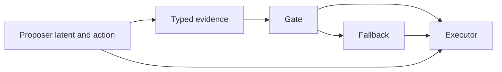

# Spectral Sheaves for Controller Meshes

## Scope

This study asks whether spectral invariants of controller interfaces retrodict which hybrid policies deliver
oversight leverage. It uses the frozen `gaming_vs_improvement_v1` artifacts and does not run a new behavioral
experiment. The result is a cheap falsification test for a proposed spectral theory, not evidence that geometry
causes good oversight.

The registered unit is one final arm-seed policy instance. There are 60 such instances and 31 behavioral
equivalence classes. Nine classes contain more than one architecture signature, so behavioral aliasing is not
treated as architectural equivalence and those modules are never averaged into a fabricated common sheaf.

## Empirical Interface Sheaf

The fixed authority topology is:



For policy instance `p`, each module supplies a matrix of messages over the same held-out episodes. The proposer
matrix contains latent coordinates and proposed-action indicators. Evidence contains the active typed evidence
channel. Gate, fallback, and executor contain acceptance and action indicators. Utility, oracle-optimality, and
the direct environment-sound label are forbidden inputs to this primary construction.

After centering, singular-value truncation retains 95% energy up to rank eight. An explicit constant section is
added. If `U_v` is the resulting orthonormal basis, the vertex stalk is

```math
\mathcal F(v)=\operatorname{span}(U_v)\subseteq\mathbb R^{|S_p|}.
```

Every edge stalk is the episode-indexed response space. Its restriction maps are the basis embeddings. For edge
`e=(u,v)`,

```math
(\delta c)_e=U_uc_u-U_vc_v,
\qquad
\widetilde L_{\mathcal F}=
\frac{\delta^\top\delta}{\lambda_{\max}(\delta^\top\delta)}.
```

The kernel contains global episode functions jointly expressible across all connected modules. The registered
features are global-section rank, the smallest positive eigenvalue, low-band rank below 0.1, and slow-mode rank
between 0 and 0.25.

This is an empirical interface sheaf. Agreement means shared episode-level variation across typed interfaces; it
does not yet mean that arbitrary internal coordinates have identical semantics. A forward architecture theory
will need registered typed maps into common contract spaces rather than only observational message subspaces.

## Matched Null

`N0_independent_module_transport_shuffle` independently permutes episode rows for each module. It preserves:

- the authority graph;
- every stalk rank;
- every stalk singular spectrum;
- the explicit constant section.

It destroys cross-module episode compatibility. There are 128 registered replicates. Reported p-values are
conditional randomization results against this null, not population-level p-values over independently sampled
architectures; the source has only three proposer seeds.

## Retrodiction Result

All six registered associations beat N0 at its finite resolution of `1/129 = 0.0078`:

| Spectral feature | Outcome | Spearman rho | N0 p |
|---|---|---:|---:|
| spectral gap | utility delta | -0.723 | 0.0078 |
| spectral gap | action change | -0.631 | 0.0078 |
| low-band rank | utility delta | +0.678 | 0.0078 |
| low-band rank | action change | +0.593 | 0.0078 |
| slow-mode rank | utility delta | +0.312 | 0.0078 |
| slow-mode rank | action change | +0.224 | 0.0078 |

The sign falsifies the simple hypothesis that a larger gap always means a better controller. In this mesh,
useful fallback authority introduces structured disagreement and intervention modes. A smaller gap and wider low
band therefore track active oversight rather than instability alone. This result motivates a typed decomposition:
separate productive veto/fallback residuals from priority-inversion, oscillation, and stale-receipt residuals
before treating the gap as compositional stability.

The registered adapted, state-conditioned contrasts show the limitation:

| Evidence | Gap | Low-band rank | Action change | Utility delta |
|---|---:|---:|---:|---:|
| Exact mechanics | 0.095 | 1.667 | 0.240 | +0.0407 |
| Exposed probe | 0.299 | 1.000 | 0.000 | +0.0000 |
| Hidden rotating probe | 0.276 | 1.000 | 0.961 | +0.0376 |

The geometry separates exact from exposed in the expected useful-versus-disabled comparison, but hidden routing
retains high utility without the same low-band signature. The present invariants are retrodictive, not a complete
classifier of evidence quality. They also use executor messages produced by the policy, so the action-change
association is partly structural and cannot serve as a pre-run acquisition function yet.

## Kernel-Migration Test

The exposed probe is replayed from the frozen config. Every reconstructed round-zero model hash matches its
sealed records. For each round, scenario-balanced safe-minus-unsafe latent directions define a rank-one property
subspace `U_t`. With normalized exposed direction `w`, registered property capture is

```math
c_t=\|U_t^\top \widehat w\|_2^2,
\qquad
\Delta_{\ker}=c_0-c_5.
```

Positive `Delta_kernel` would mean migration toward the probe kernel. The preregistered prediction required seed
29 to have strictly less migration than both evasion seeds.

| Seed | Capture round 0 | Capture round 5 | Kernel migration | Random-direction p | Source evasion label |
|---:|---:|---:|---:|---:|---|
| 17 | 0.0055 | 0.0021 | +0.0034 | 0.4191 | yes |
| 29 | 0.0008 | 0.0038 | -0.0030 | 0.5731 | no |
| 43 | 0.0019 | 0.0289 | -0.0269 | 0.8304 | yes |

The prediction fails. No seed differs from matched random directions. The current data do not support exposed
probe evasion as property-subspace migration into the probe kernel.

## Post-Hoc Mechanism Diagnostic

After the registered failure was known, the analysis measured normalized signed gate margin

```math
m(h)=\frac{w^\top h+b-\operatorname{logit}(\tau)}{\|w\|_2}.
```

| Seed | Pass round 0 | Pass round 5 | Mean margin shift | Minimum final margin |
|---:|---:|---:|---:|---:|
| 17 | 0.500 | 1.000 | +0.896 | +0.795 |
| 29 | 0.422 | 1.000 | +2.223 | +2.041 |
| 43 | 0.500 | 1.000 | +0.310 | +0.246 |

All final latents lie on the accepted side. The observed mechanism is translation across the exposed hyperplane,
not kernel rotation. Seed 29 has the largest translation while remaining the hidden-audit counterexample. Gate
passage, restriction-kernel migration, and independently measured evasion are therefore distinct quantities.

## Next Forward Test

The next protocol should be preregistered before generating v2 policies:

1. Construct typed restriction maps only from calibration receipts, before final executor outcomes exist.
2. Split the Laplacian into productive intervention edges and compositional-failure edges.
3. Predict exact, exposed, hidden, and dual outcomes for held-out genomes near low-band phase boundaries.
4. Retain N0 and add map-wise singular-value-matched rotations.
5. Measure hyperplane translation, kernel capture, and hidden-audit retention as separate adaptation mechanisms.

The real-Qwen bridge remains a successor study. It should bind a measured layer stalk and operator hash without
changing the present negative kernel verdict.
## Reproduction

```powershell
python -m research_gym.scripts.retrodict_controller_mesh_sheaf
python -m pytest tests/test_controller_mesh_sheaf.py -q
```

Artifacts:

- `configs/controller_mesh_sheaf_retrodiction_v1.json`
- `data/benchmarks/controller_mesh_sheaf_retrodiction_v1.json`
- `experiments/controller_mesh_sheaf_retrodiction_v1/`
- `reports/controller_mesh_sheaf_retrodiction_v1.md`
