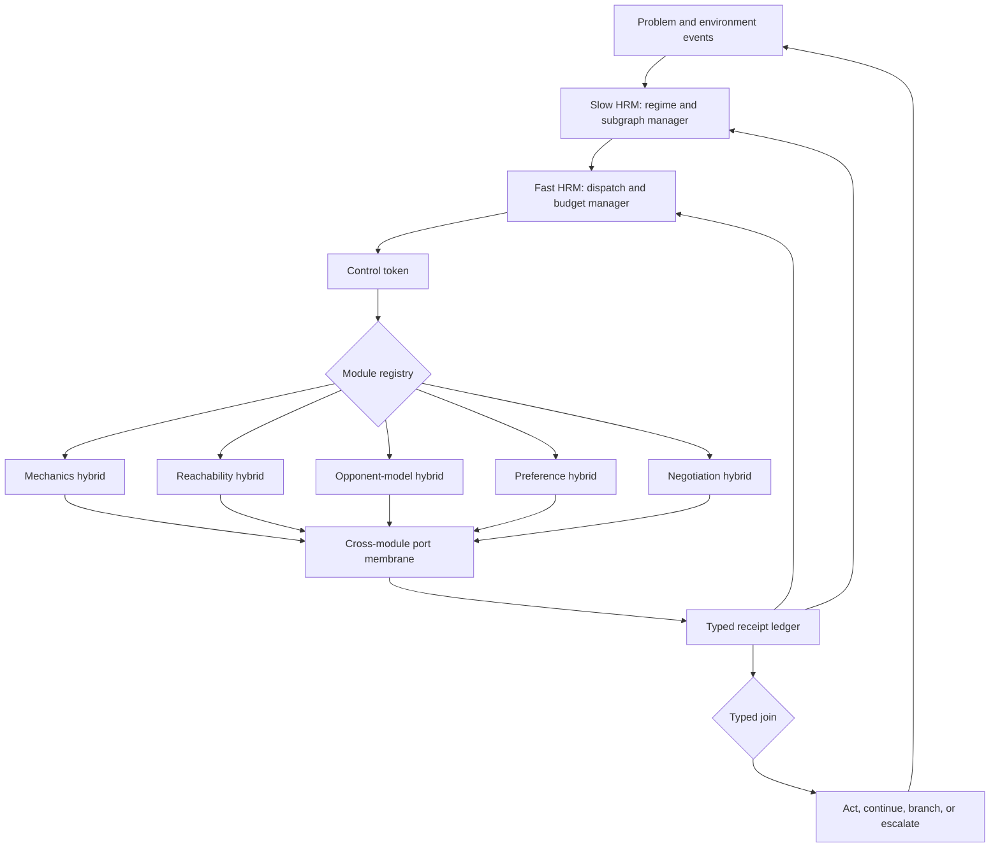

# Conductor-HRM: Hierarchical Typed Module Flow

## Thesis

Conductor-HRM is an HRM-managed graph of hybrid reasoning modules.

Each worker module is itself a typed TRM/LDT hybrid:

```text
private TRM state -> proposal -> typed membrane -> public lattice state
```

The HRM does not replace this loop. It manages the flow between many such loops. Its job is to decide which
module should run, what budget it receives, when work should branch, when receipts can join, and when the system
should suspend or escalate.

The defining invariant is:

> The HRM may control execution flow, but it may not directly mutate a module's public lattice or strengthen the
> provenance of a module receipt.

This makes the architecture hierarchical without creating an untyped super-controller.

The formal name is Hierarchical Typed Module Flow (HTMF). `Conductor-HRM` is the shorter architecture name.

## Why another hierarchy

A single TRM/LDT hybrid answers a local control question:

```text
Should this proposal become a durable refinement?
```

A system with several hybrids has a second problem:

```text
Which reasoner should act next, which outputs should be combined, and how much computation should each receive?
```

A flat router can select one module, but it has no persistent model of a multi-stage reasoning process. It does
not naturally remember that a reachability module stalled, an opponent model is stale, a mechanics certificate
is expiring, or two speculative branches should be compared after a later observation.

Conductor-HRM uses hierarchical recurrence to manage that temporal structure.

## Architecture



There are three state layers.

### Module-private state

Module $i$ owns recurrent workspace $h_i$ and explicit lattice state $a_i$:

```text
h_i' = TRM_i(h_i, x_i, a_i)
q_i  = proposal_i(h_i', a_i)
d_i  = membrane_i(q_i, a_i, mechanics_i)
a_i' = apply(a_i, d_i)
```

No other module and neither HRM level can write $a_i$ directly.

### Fast managerial state

The fast HRM state $u_t$ manages immediate dispatch, retries, local budgets, and joins:

```text
u_{t+1} = F_fast(u_t, g_k, summary(B_t))
c_t     = control_head(u_{t+1}, g_k, B_t)
```

It reacts to each module receipt or environment event.

### Slow managerial state

The slow HRM state $g_k$ manages the current regime, active module subgraph, objective priorities, and budget
envelope. It updates at macro-boundaries or on exceptional events:

```text
g_{k+1} = F_slow(g_k, pool(u_{t_0:t_1}), summary(B_{t_1}))
```

Useful slow-update triggers include:

- a module reaches a fixpoint;
- a certificate expires;
- a typed join reaches bottom;
- the environment changes phase;
- a resource budget crosses a threshold;
- a repeated dispatch cycle is detected;
- the current objective or opponent regime changes.

## Typed receipt ledger

The shared public object is a ledger, not a shared latent vector:

```text
B_t = (A_t, R_t, G_t, budget_t)
```

where:

- $A_t = product_i(a_i)$ is the collection of module-owned public states;
- $R_t$ is an append-only set of typed receipts;
- $G_t$ is the currently active flow graph;
- $budget_t$ records calls, tokens, wall time, search nodes, or game ticks.

An HRM input sees a bounded summary of $B_t$. It does not receive raw module-private recurrent states. This keeps
cross-module influence inspectable and prevents private-state coupling from silently bypassing the membranes.

Each module invocation returns a receipt:

```text
ModuleReceipt
  module_id
  invocation_id
  input_digest
  output_digest
  payload_ref
  soundness_type
  certificate_ref
  confidence
  residual_or_conflict
  cost
  valid_until
```

Confidence and soundness remain separate fields. High confidence does not create hard authority.

## Control tokens

The HRM emits a typed control token rather than an unrestricted command:

```text
ControlToken
  operation
  module_id
  input_receipt_refs
  objective_id
  required_output_type
  budget
  branch_id
  join_key
  ttl
```

The operation is one of:

- `ACTIVATE`: start a module invocation;
- `CONTINUE`: grant another local iteration or proposal budget;
- `BRANCH`: create isolated speculative module states;
- `JOIN`: request a typed merge of compatible receipts;
- `SUSPEND`: stop spending without discarding public receipts;
- `ESCALATE`: route conflict or missing authority to a designated module or human boundary;
- `TERMINATE`: emit a final answer or action with its receipt set.

The module registry validates tokens against each module's declared input schema, output schema, preconditions,
cost class, and authority scope. A malformed or unauthorized token fails closed.

## Cross-module authority

Environment soundness is scoped. A receipt from module $i$ is not automatically environment-sound inside module
$j$.

An environment certificate should bind at least:

```text
(source environment, mechanic version, state digest, predicate, validity interval)
```

The port membrane applies two rules:

1. Transfer cannot strengthen provenance.
2. The destination may issue a new environment-sound certificate only by validating the payload against its own
   mechanics and current state.

For example, an opponent-model receipt can guide a reachability branch, but it cannot hard-delete a route. A
reachability module may produce a new environment-sound dead-route receipt only if the route is impossible under
the mechanics actually in scope.

The ledger preserves both records:

```text
source receipt: model-sound forecast
destination receipt: environment-sound route conflict, derived by destination validation
```

This prevents receipt laundering, where repeated module transfers gradually turn a heuristic belief into an
apparently certified fact.

## Branch and join

Branching is useful when preference, opponent, and mechanics modules disagree.

Each branch receives an isolated view of candidate public state. Speculative updates are not committed to the
main module lattices. A join may commit only when:

- required receipts are present;
- receipt validity intervals still cover the current state;
- destination schemas agree;
- all hard certificates are mutually compatible;
- the proposed lattice meet is not bottom.

If a join reaches bottom, the conflict becomes a public receipt and the HRM must branch, suspend, or escalate. It
cannot solve the conflict by overwriting a module.

## HRM-managed execution

Module calls are semi-Markov options because different modules consume different time and budgets. Let $o_t$ be
a control token selecting a module option. The module returns after duration $delta_t$:

```text
(receipt_t, delta_t, cost_t) = execute(o_t, B_t)
B_{t+1} = port_and_append(B_t, receipt_t)
```

The scheduler objective is constrained rather than purely scalar:

```text
maximize    expected task utility - lambda_cost * computation - lambda_latency * latency
subject to  unauthorized_hard_updates = 0
            invalid_joins = 0
            budget <= budget_max
```

The zero-violation conditions should be enforced structurally by membranes and registries. They should not be
left as soft penalties for the HRM to trade away.

## Training losses

After structural constraints, the conductor can be trained with:

```text
L = L_task
  + lambda_route * L_route_regret
  + lambda_cost * L_cost
  + lambda_cycle * L_cycle
  + lambda_cal * L_calibration
  + lambda_join * L_join_prediction
  + lambda_credit * L_module_credit
```

Where:

- `L_task` measures final task or game outcome;
- `L_route_regret` compares selected flow with the best available module flow;
- `L_cost` penalizes unnecessary calls and oversized proposal budgets;
- `L_cycle` penalizes module thrashing and repeated receipt-equivalent calls;
- `L_calibration` trains confidence as a probability of local usefulness, not authority;
- `L_join_prediction` predicts whether a receipt set will join cleanly;
- `L_module_credit` assigns delayed outcome credit to the modules and control decisions that mattered.

Suggested training order:

1. Freeze modules and train the conductor from oracle flow traces.
2. Use the current skill-router benchmark as one-step routing pretraining.
3. Generate multi-stage traces with forced stalls, stale receipts, and conflicts.
4. Apply imitation or DAgger to recover from bad module-flow states.
5. Optimize cost and outcome with constrained RL while membranes remain frozen.
6. Fine-tune module proposal heads only after conductor behavior is stable.

## Worked game flow

Consider a TheySing action under an active pact.

1. The slow HRM identifies an `institutional_conflict` regime and activates negotiation, pact-authority, strategic
   utility, and mechanics modules.
2. The fast HRM branches the proposed attack into a utility branch and an authority branch.
3. The utility module returns a high-confidence strategic-gain receipt. Its provenance is model- or
   experience-sound.
4. The pact module returns the active pact type and parties with an environment certificate.
5. The mechanics module validates the action and identifies whether the conflict is bilateral or destructive
   institutional conflict.
6. A typed join applies the selected enforcement policy:
   - hard flow blocks either conflict;
   - soft flow executes either conflict with sanctions;
   - graduated flow blocks the institutional conflict and executes the bilateral conflict with sanctions.
7. The outcome receipt updates the ledger. The slow HRM may change the active subgraph if trust, sanctions, or the
   game phase changes.

The HRM manages the sequence and computation. Native mechanics retain authority over whether the action commits.

## Difference from mixture of experts

Conductor-HRM is not only a mixture-of-experts router.

- Modules are stateful across calls.
- A flow may invoke several modules, branch, and join rather than select one expert.
- Module outputs carry provenance, validity, and certificates.
- Hard authority is scoped and checked at destination ports.
- The scheduler has persistent slow and fast recurrent states.
- Computation and latency are explicit budgets.
- A failed join is represented as conflict, not averaged away.

## Failure modes

### Scheduler collapse

The HRM always selects one familiar module. Measure module entropy and route regret; train with counterfactual flow
labels.

### Module thrashing

The HRM cycles between modules without new receipts. Use receipt digests, per-edge cooldowns, call TTLs, and a
cycle loss.

### Receipt laundering

Soft evidence becomes hard after several transfers. Prohibit provenance upgrades and require destination-issued
certificates.

### Stale certification

A valid receipt is reused after state changes. Bind certificates to state digests and validity intervals.

### Speculative state leakage

A branch mutates committed public state. Give each branch copy-on-write lattice views and commit only through a
typed join.

### Global deadlock

Every module abstains or rejects the available receipts. Require an explicit escalation module and bounded
deadlock detection.

### Manager overreach

The HRM learns to encode unsupported instructions in control-token payloads. Keep tokens schema-bounded and let
module registries reject undeclared fields and authority requests.

## Initial module registry

An implementable first registry for this repository is:

| Module | TRM role | LDT/public role | Typical receipt |
|---|---|---|---|
| Mechanics | propose action interpretation | legality and transition certificate | environment-sound |
| Reachability | rank branches | finite-horizon live/dead lattice | environment- or model-scoped |
| Opponent model | recurrent behavior forecast | explicit scenario set | model-sound |
| Preference | rank moral/strategic utility | interval or Pareto state | experience/model-sound |
| Negotiation | propose messages and pacts | commitment and party constraints | mixed |
| Provenance | infer likely evidence source | certificate and lineage lattice | environment-sound when attested |
| Memory | retrieve prior episodes | replay candidate set | experience-sound |

## Benchmark plan

### E1: flow correctness

Generate synthetic module graphs with known oracle flows. Measure token validity, join correctness, unauthorized
hard-update count, and cycle rate.

### E2: composition shift

Train on single- and two-module flows. Evaluate held-out three- and four-module compositions. Compare against a
flat router and an always-call-all baseline.

### E3: budget frontier

Sweep module-call and proposal budgets. Report task utility, unsafe action rate, calls, latency, and certificate
coverage.

### E4: TheySing multi-stage flow

Use the native traces to create events for negotiation, pact authority, action legality, and sanctions. Compare:

- fixed hard flow;
- fixed soft flow;
- fixed graduated flow;
- flat learned skill router;
- Conductor-HRM with the same modules and budget.

### E5: regime change

Change pact type, opponent behavior, or objective midway through an episode. Test whether the slow HRM changes
the active subgraph while the fast HRM preserves local continuity.

## Testable predictions

1. Conductor-HRM should beat a flat skill router on tasks requiring two or more module transitions.
2. It should approach always-call-all accuracy with fewer module calls.
3. It should preserve zero unauthorized hard updates because flow control cannot bypass membranes.
4. Its advantage should increase under regime changes and delayed credit.
5. The speculative variant should improve utility but cost more than the conservative single-path variant.
6. Without receipt validity and cycle controls, it should fail through stale certificates and module thrashing.

## Minimal prototype boundary

The first implementation does not need a trained HRM. A dependency-free recurrent scheduler can exercise the
contract with:

```text
ModuleCard
ModuleReceipt
ControlToken
FlowLedger
ModuleRegistry
ConductorState(slow_state, fast_state)
```

A deterministic scheduler should first reproduce oracle flows and failure cases. A learned HRM can then replace
only the scheduler while module membranes and receipt validation remain unchanged.
