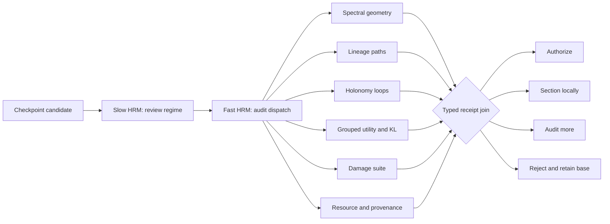

# RSITopology-Aware HRM Training Review

## Purpose

This protocol connects the local RSITopology identity mathematics to Conductor-HRM review of new model
training. The HRM schedules evidence-producing modules and joins sealed receipts. It does not infer behavioral
safety from geometry, inspect outcomes during target-blind bundle discovery, mutate weights, or strengthen a
certificate.

The review question is not a single scalar:

```text
Is this model good?
```

It is a typed set of questions:

```text
Is a feature bundle stable enough for invariant allocation?
Are signed coordinates comparable across checkpoints and contexts?
Did the candidate improve grouped held-out behavior?
Did it pass matched controls and damage tests?
Did the capped training run produce complete provenance and cleanup receipts?
```

## Review graph



The slow state tracks the training mechanism, checkpoint/context regime, frozen policy, and active review
subgraph. The fast state selects the next edge, loop, utility stratum, damage case, or resource receipt to audit.
Neither state writes weights. The only output with operational authority is a hash-bound authorization receipt.

## Target-blind spectral bundle

For prompt or context stratum `p`, RSITopology forms a normalized reliability-weighted sheaf Laplacian:

$$
\widetilde L_p =
\frac{\delta_p^\top W_p\delta_p}
{\lambda_{\max}(\delta_p^\top W_p\delta_p)}.
$$

For a frozen spectral interval $I_b$, define

$$
P_b(p)=\mathbf{1}_{I_b}(\widetilde L_p),\qquad
\overline P_b=\frac{1}{|\mathcal P|}\sum_{p\in\mathcal P}P_b(p),
$$

and infer the consensus bundle

$$
U_b=\operatorname{im}\mathbf{1}_{[\rho,1]}(\overline P_b).
$$

This infers rank from occupancy instead of guessing a dimension. Projectors from different sites are comparable
only after their Jacobians are registered into a common edit space. Failed naturality or secant gates stop the
cross-site bundle claim.

The target-blind candidate signal is invariant bundle energy:

$$
e_b(x)=\frac{\|U_b^\top x\|_2^2}{\|x\|_2^2}.
$$

The geometry module seals the band, occupancy margin, inferred rank, Jacobian registrations, model hash,
dataset hash, and operator hash before outcome reveal.

## Lineage and holonomy

For orthonormal frames at adjacent checkpoints or contexts,

$$
U_b^\top U_a=Q_{b\leftarrow a}S_{ba}.
$$

The singular values in $S_{ba}$ measure principal-angle retention. The polar factor $Q_{b\leftarrow a}$
transports signed coordinates. A registered loop has holonomy

$$
H_{\square}=
Q_{00\leftarrow01}Q_{01\leftarrow11}
Q_{11\leftarrow10}Q_{10\leftarrow00},
$$

with gauge-invariant average identity loss

$$
\kappa_{\square}=1-\frac{\operatorname{tr}(H_{\square})}{r}.
$$

Strong edge retention does not imply a globally stable signed frame. A sequence of individually small rotations
can accumulate around a loop. If $\det(H)<0$, orientation reverses and canonical signed angles are not trusted.
The loop audit must also beat a matched null conditioned on rank, perimeter, edge retention, uncertainty, and
visibility. This distinguishes area-scaling planted curvature from perimeter-scaling estimation noise.

## Conservative signed-control gate

For each edge, let $W_e$ be the lower-bounded worst-direction squared retention. For a path with transport
$H=Q_m\cdots Q_1$, the RSITopology control theorem gives

$$
\|M-I\|_2
\leq
\sum_{e=1}^{m}(1-\sqrt{W_e})+\|H-I\|_2.
$$

For orientation-preserving $H$ with maximum canonical angle $\alpha_{\max}$,

$$
\|H-I\|_2=2\sin\left(\frac{\alpha_{\max}}{2}\right).
$$

Orientation reversal sets this displacement to the worst case, 2. The implemented conservative receipt uses
one-sided uncertainty:

$$
\widehat R = \min\left\{2,
\sum_e\left(1-\sqrt{\max(0,W_e-u_e)}\right)
+2\sin\left(\frac{\min(\pi,\alpha+u_\alpha)}{2}\right)
\right\}.
$$

An unmeasured loop also sets $\widehat R=2$. With simultaneous one-sided coverage at least $1-\delta$, signed
control is authorized only if

$$
\widehat R\leq\epsilon,
\qquad
\Pr(\text{authorize and }\|M-I\|_2>\epsilon)\leq\delta.
$$

This is a false-authorization guarantee for registered signed coordinates. It is not a guarantee of general
behavioral safety or self-improvement.

## Utility and allocation

Bundle energy can tilt training-data, skill, or candidate allocation without selecting a signed direction:

$$
\pi_\eta(i\mid s)=
\frac{\pi_0(i\mid s)\exp(\eta\widehat\Delta_{u,i})}
{\sum_j\pi_0(j\mid s)\exp(\eta\widehat\Delta_{u,j})}.
$$

The largest allowed $\eta$ must satisfy the frozen realized-KL budget

$$
D_{\mathrm{KL}}(\pi_\eta\|\pi_0)\leq K_{\max}.
$$

Authorization also requires positive grouped held-out gain, positive standardized uplift, enough independent
replicates, and a win over matched-rank Haar controls. The descriptive information coefficient

$$
\mathrm{IC}=\frac{\text{standardized uplift}}
{\sqrt{2D_{\mathrm{KL}}(\pi_\eta\|\pi_0)}}
$$

is recorded but is not the primary gate.

## Certificate levels

| Level | Meaning | Permitted role |
|---|---|---|
| `engineering_evidence` | Hash-bound measurements exist | Observation and ordinary optimizer review |
| `lineage_certified` | Stable registered bundle and conservative edge retention | Invariant bundle-energy allocation |
| `holonomy_clean` | Measured, orientation-preserving, null-cleared loops satisfy the risk budget | Global signed reward or signed control |

Model promotion is never authorized by identity level alone. It separately requires grouped held-out utility,
matched controls, a held-out damage suite, OS-enforced resource caps, chunk and checkpoint policy, structured
events and resource metrics, timeout compliance, abort status, and process-owned cleanup receipts.

The required identity level depends on how the candidate was trained:

| Training mechanism | Promotion identity requirement | High-holonomy response |
|---|---|---|
| Ordinary optimizer | `engineering_evidence` | Behavioral review can proceed; signed interpretation is withheld |
| Bundle-energy allocation | `lineage_certified` | Allocation can proceed under KL and utility gates |
| Global signed control | `holonomy_clean` | Route to sectioning or reject global signed use |
| Sectioned signed control | `lineage_certified` plus every patch `holonomy_clean` | Audit or rebuild incomplete patches |

## Sectioning response

When lineage is strong but global holonomy is not clean, a direct global low-rank edit has the wrong shape. The
HRM calls a sectioning module over the context-by-checkpoint grid. It builds maximal connected patches of
measured, orientation-preserving plaquettes within the holonomy budget, transports one rooted coordinate per
patch, and excludes dirty or unmeasured cells.

The sectioner returns patch births/deaths across budgets and ranks missing loop audits by expected reduction in
patch-boundary uncertainty. A sectioning route is not authorization. Every destination patch still needs its own
`holonomy_clean` certificate, utility join, damage receipt, and trust radius.

## Review protocol

1. Register `RunId`, model/dataset/operator hashes, hard memory/CPU/I/O caps, timeout, chunk strategy, checkpoint
   cadence, structured event/summary logs, resource metrics, abort semantics, and process-owned cleanup policy.
2. Freeze spectral bands, occupancy threshold, risk budget $\epsilon$, simultaneous coverage $1-\delta$, KL
   budget, grouped strata, matched controls, and damage suite.
3. Seal target-blind geometry before reading candidate outcomes.
4. Audit edge lineage, rooted transports, off-tree loops, orientation, and the matched noise null.
5. Reveal grouped utility and compute realized KL only after the geometry seal.
6. Join utility, damage, provenance, and resource receipts without upgrading any source type.
7. Emit one route: `authorize`, `section`, `audit`, or `reject`.
8. Bind the decision to all input hashes. Any changed checkpoint, dataset, operator, or policy requires review again.

## Implemented contract exercise

`python -m research_gym.scripts.review_model_training` evaluates ten deterministic synthetic receipt cases. It
does not train a neural model. The saved matrix demonstrates:

- clean signed control authorizes at a conservative bound of `0.095`;
- high measured holonomy sections at `0.757`;
- orientation reversal sections with worst-case bound `2.000`;
- an unmeasured loop audits with worst-case bound `2.000`;
- six strong local-retention edges still section when the path bound reaches `0.530`;
- failed grouped utility rejects despite `holonomy_clean` geometry;
- ordinary and invariant bundle promotion can proceed despite high signed holonomy;
- incomplete checkpoint and cleanup receipts route promotion to resource audit.
- an aborted run remains structured evidence but is rejected for completed-model promotion.

These outcomes validate control-flow semantics only. Native capped model-training experiments remain required.

## Alternative managerial designs

- A scalar HRM reward could combine geometry, utility, damage, and cost. It is rejected because high utility could
  purchase an unauthorized signed intervention.
- A geometry-first manager could promote every `holonomy_clean` candidate. It is rejected because coordinate
  identity does not imply behavioral gain.
- A behavior-only manager could ignore internal identity. It remains valid for ordinary optimizer promotion, but
  it cannot support signed cross-checkpoint rewards or edits.
- A conservative manager could reject all high-holonomy candidates. Sectioning is preferable when local flat
  patches preserve useful, certifiable control.

VPD is not part of this protocol.
