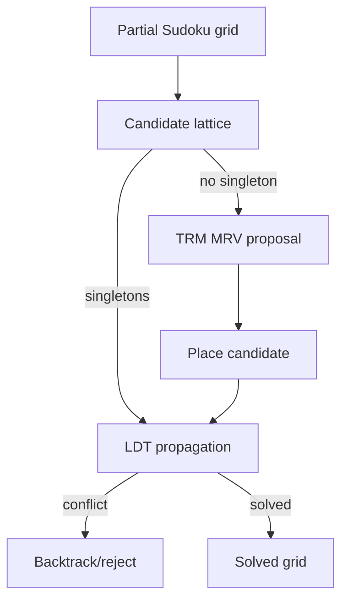

# A Typed Membrane Between Latent Proposal and Explicit Deduction

## Abstract

We study a small hybrid reasoning architecture that combines a Tiny Recursive Model style proposal mechanism with an explicit Lattice Deduction Transformer style state. The central design is a typed membrane: the latent side proposes refinements, while the explicit lattice side certifies, rejects, or soft-stores them according to provenance. The goal is not to claim that a lattice guarantees correct abstention in all settings. The narrower claim is that an explicit lattice makes abstention, bottom, monotonicity, and provenance inspectable in domains where the relevant mechanics are checkable.

We evaluate this design on five lightweight benchmarks: Sudoku, ARC-1, ARC-2, environment-pointer routing, and a coupled storyworld playing task. Across the saved runs, hybrid matches the best aggregate score in every task family. It improves proposal efficiency in Sudoku and aggregate ARC-2, repairs unsafe TRM actions in storyworld play, and avoids hard-eliminating routes when LDT evidence is only lexical and therefore not environment-sound. The main negative result is that hybrid is not automatically superior: in routing it only ties TRM when LDT candidate sets are treated as soft evidence, and in two ARC-2 instances its heuristic proposal order uses more proposals than raw TRM.

## 1. Motivation

The motivating question is practical:

```text
Can persistent latent recurrence improve explicit lattice deduction
without destroying the interpretability and soundness benefits
of an explicit abstract state?
```

We separate two roles:

- `TRM`: private recurrent or heuristic workspace that proposes actions, refinements, routes, or candidate rules.
- `LDT`: explicit public lattice state that supports monotone refinement, bottom detection, serialization, and typed provenance.

The hybrid architecture is useful only if these roles remain separated. If latent proposals can directly mutate durable state, the system loses the main benefit of explicit deduction. If the lattice is the only mechanism, the system struggles when local propagation is insufficient and search or heuristic proposal is needed.

## 2. Architecture

### 2.1 Two States

At step `t`, the hybrid keeps:

```text
a_t: explicit abstract state
h_t: private latent or heuristic state
```

`a_t` is public and checkable. In this implementation it is often a candidate-set lattice, but the same interface also covers intervals, symbolic constraints, reachable regions, possible rules, and possible environment IDs.

`h_t` is private workspace. It can remember correlations, infer regimes, rank proposals, and track search context. It does not directly mutate `a_t`.

### 2.2 Hybrid Loop

```mermaid
flowchart LR
  X[Task state / prompt] --> A[Explicit state a_t]
  X --> H[TRM latent state h_t]
  H --> P[Proposal p_t]
  A --> M[Typed membrane]
  P --> M
  M -->|environment-sound + monotone| A2[Hard update a_{t+1}]
  M -->|model/experience-sound| S[Soft store / telemetry]
  M -->|unknown/non-monotone/bottom| R[Reject / abstain]
  A2 --> Y[Action / prediction / next state]
  S --> Y
  R --> Y
```

The membrane is the core object. It enforces the distinction between proposal and deduction.

## 3. Lattice Formulation

For the candidate-state implementation, let slots be indexed by `i in I`. Each slot has a finite universe `U_i`. A lattice state is:

```math
a = \{ C_i \subseteq U_i \}_{i \in I}
```

The top state is:

```math
\top = \{ U_i \}_{i \in I}
```

The bottom condition is:

```math
\bot(a) \iff \exists i \in I: C_i = \emptyset
```

Meet is pointwise intersection:

```math
(a \wedge b)_i = C_i^a \cap C_i^b
```

A proposal `p_t` contains a proposed state `\hat{a}_{t+1}`. It is monotone only if:

```math
\forall i \in I,\quad \hat{C}_{i,t+1} \subseteq C_{i,t}
```

The implementation rejects non-monotone proposals before applying meet:

```math
\operatorname{reject}(p_t) \quad \text{if} \quad \exists i: \hat{C}_{i,t+1} \nsubseteq C_{i,t}
```

This matters because otherwise a widening proposal could be hidden by a subsequent meet and appear harmless.

## 4. Typed Soundness

Each proposal carries provenance:

```text
environment-sound: derived from trusted environment mechanics
model-sound: derived from a model of another agent or learned predictor
experience-sound: derived from replay or discovered successes
unknown: no usable provenance
```

The default membrane policy is:

```math
\operatorname{hard}(p) =
\begin{cases}
1 & \text{if provenance}(p)=\text{environment-sound}\\
0 & \text{otherwise}
\end{cases}
```

The durable transition is:

```math
a_{t+1} =
\begin{cases}
a_t \wedge \hat{a}_{t+1} & \text{if hard}(p_t) \land \hat{a}_{t+1}\sqsubseteq a_t \land \neg\bot(a_t \wedge \hat{a}_{t+1})\\
a_t & \text{otherwise}
\end{cases}
```

Bottom is allowed only in explicit abstain/conflict mode:

```math
\bot(a_t \wedge \hat{a}_{t+1}) \Rightarrow \text{accept only if mode}=\text{ABSTAIN}
```

Soft proposals are not discarded. Model-sound and experience-sound proposals can be soft-stored as telemetry:

```math
s_{t+1} = s_t \cup \{p_t\}
```

but this does not change the durable lattice state.

## 5. Control Dynamics and Alternative Architectures

The typed membrane is one point in a larger design space. We compare it with two implementable alternatives to separate the value of hybridization from the risks introduced by the control policy.

Let `q_theta` denote the TRM proposal or scoring mechanism. In the typed membrane:

```math
p_t = q_\theta(h_t,a_t,x_t), \qquad p_t=(\hat a_{t+1},\tau_t,m_t)
```

Durable state changes only through the membrane:

```math
a_{t+1} =
\begin{cases}
a_t \wedge \hat a_{t+1} & \tau_t=\text{environment-sound},\ \hat a_{t+1}\sqsubseteq a_t,\ \neg\bot(a_t\wedge\hat a_{t+1})\\
a_t & \text{otherwise}
\end{cases}
```

Alternative 1 is a hard-gated cascade:

```math
C_t = \operatorname{LDT}(x_t), \qquad
y_t = \arg\max_{y\in C_t} q_\theta(y\mid x_t)
```

This is attractive when `C_t` is environment-sound, but unsafe when `C_t` is lexical or learned.

Alternative 2 is confidence arbitration. Let `s_1(x_t)` and `s_2(x_t)` be the top two TRM scores:

```math
\Delta_t=s_1(x_t)-s_2(x_t)
```

Then:

```math
y_t =
\begin{cases}
\arg\max_y q_\theta(y\mid x_t) & \Delta_t\ge\gamma\\
\arg\max_{y\in C_t} q_\theta(y\mid x_t) & \Delta_t<\gamma
\end{cases}
```

The threshold `gamma` is selected on the training split from `[0.0, 0.5, 1.0, 2.0, 4.0]`. On the saved routing run, `gamma=0.0`, meaning any positive use of noisy LDT routing candidates reduces training accuracy; confidence arbitration degenerates to TRM on this slice.

## 6. Practical Hybrid Dynamics

### 6.1 Sudoku

LDT performs naked-single propagation. TRM performs heuristic MRV search. Hybrid lets TRM propose a branch and then applies LDT propagation after the proposal.



Observed result:

```text
LDT:    1/3 solved
TRM:    3/3 solved, 31 guesses
Hybrid: 3/3 solved, 6 guesses
```

Interpretation: TRM is useful for escaping propagation plateaus. LDT is useful immediately after proposals because it collapses implied consequences and reduces further guessing.

### 6.2 ARC-1 and ARC-2

ARC-1 is a single-rule grid transformation benchmark. ARC-2 uses ordered two-rule compositions.

LDT derives broad rule-family constraints from input/output invariants. TRM searches primitive rules or ordered pairs. Hybrid restricts proposals by LDT families and certifies them against training examples.

```math
\mathcal{R}: \text{primitive rule set}
```

For ARC-1:

```math
\hat{r} = \operatorname{TRM}(x), \quad
\operatorname{accept}(\hat{r}) \iff \forall (x_j,y_j)\in D_\text{train}: \hat{r}(x_j)=y_j
```

For ARC-2:

```math
\hat{r} = r_b \circ r_a
```

and the same train-pair certification applies.

Observed aggregate results:

```text
ARC-1: LDT 1.000, TRM 1.000, Hybrid 1.000
ARC-2: LDT 1.000, TRM 1.000, Hybrid 1.000
```

Efficiency:

```text
ARC-1: hybrid 5 proposals, TRM 9 proposals
ARC-2: hybrid 32 proposals, TRM 38 proposals
```

Negative subcase: on two ARC-2 tasks, hybrid uses more proposals than TRM because the current pair ordering is heuristic. This is not a soundness failure. It is a proposal-ranking failure.

### 6.3 Environment-Pointer Routing

Routing maps a prompt to an environment ID. The Tesseract TRM reference trains a TF-IDF plus MLP router. The dependency-light benchmark here uses a lexical TRM analogue.

LDT builds token-derived candidate sets:

```math
C_t = \bigcap_{w \in \operatorname{tokens}(x)} E_w
```

where `E_w` is the set of environments strongly associated with token `w`.

This evidence is not environment-sound. It is model/experience-derived. Therefore the final hybrid design uses it as soft guidance only:

```math
\operatorname{route}_\text{hybrid}(x)=
\begin{cases}
\arg\max_{e \in C_t} \operatorname{TRM}(e \mid x) & \text{if TRM top route is in } C_t\\
\arg\max_{e} \operatorname{TRM}(e \mid x) & \text{otherwise}
\end{cases}
```

Observed result:

```text
LDT:    0.474
TRM:    0.815
Hybrid: 0.815
Hybrid hard filter: 0.584
```

Design lesson: when LDT evidence is lexical and learned from data, hard elimination is unsafe. The hybrid must distinguish soft route telemetry from environment-sound pruning. In this deterministic run, forcing token-lattice candidates as hard filters reduces accuracy from `0.815` to `0.584`.

### 6.4 Storyworld Playing

The storyworld has exact transitions and a modeled rival policy. LDT uses finite-horizon reachability. TRM uses a greedy local-deficit heuristic. Hybrid lets TRM propose an action, then checks whether the action preserves modeled reachability.

```math
\operatorname{safe}(s,a,H) =
\operatorname{Reachable}_{\text{model}}(T(s,a,\pi_\text{rival}(s)), H-1)
```

Hybrid action selection:

```math
a_t =
\begin{cases}
a^\text{TRM}_t & \text{if safe}(s_t,a^\text{TRM}_t,H-t)\\
a^\text{LDT}_t & \text{if } a^\text{LDT}_t \text{ exists}\\
a^\text{TRM}_t & \text{otherwise}
\end{cases}
```

This is also where the richer storyworld intuition enters the paper. Secret endings and morality optimization are not the same control problem. A secret ending is a typed gate: the system either preserves reachability to a specific latent ending predicate or it does not. A morality objective is a soft preference surface: it can reward trust, evidence, low heat, and scene progress without being an environment-sound proof obligation. This mirrors the difference between worlds such as medical triage or bioethics councils, where some constraints are hard safety gates while others are soft value tradeoffs.

Observed result:

```text
LDT:    64/64 solved
TRM:    11/64 solved
Hybrid: 64/64 solved, 124 overrides
```

Interpretation: TRM local heuristics often rush into terminal states that fail the secret-ending predicate. LDT reachability prevents those traps. Hybrid preserves the proposal interface while repairing unsafe choices.

## 7. Benchmark Summary

| Benchmark | LDT | TRM | Hybrid | Best |
|---|---:|---:|---:|---|
| Sudoku | 0.333 | 1.000 | 1.000 | TRM, Hybrid |
| ARC-1 | 1.000 | 1.000 | 1.000 | all |
| ARC-2 | 1.000 | 1.000 | 1.000 | all |
| Routing | 0.474 | 0.815 | 0.815 | TRM, Hybrid |
| Storyworld | 1.000 | 0.172 | 1.000 | LDT, Hybrid |

The aggregate pattern is:

- TRM helps when proposal/search/routing is needed.
- LDT helps when mechanics are checkable.
- Hybrid helps when proposal can be followed by checkable pruning or safety checks.
- Hybrid does not automatically improve learned routing if the LDT side has only soft lexical evidence.

Routing architecture variants:

| Architecture | Accuracy | Correct | Control Policy |
|---|---:|---:|---|
| Typed membrane | 0.815 | 141/173 | soft telemetry unless sound |
| Hard gate | 0.584 | 101/173 | LDT candidates hard-filter TRM |
| Confidence arbitration | 0.815 | 141/173 | train-selected `gamma=0.0` |

Storyworld confidence/type split:

| Scenario | Policy | Success Rate | Avg Score |
|---|---|---:|---:|
| Secret ending | Typed membrane | 1.000 | 1.00 |
| Secret ending | Confidence arbitration | 0.938 | 0.94 |
| Moral optimization | Typed membrane | 1.000 | 9.95 |
| Moral optimization | Confidence arbitration | 1.000 | 11.06 |

## 8. Design Decisions and Alternatives

### 8.1 Hard vs Soft Application

Decision: hard-apply only environment-sound refinements by default.

Alternative: allow model-sound or experience-sound hard updates. This would make routing and replay-derived pruning more aggressive, but it risks false eliminations. The routing benchmark demonstrates the risk: hard LDT filtering from token evidence underperformed TRM, with the hard-filter hybrid ablation at `0.584` versus `0.815` for TRM and soft hybrid.

### 8.2 Reject Non-Monotone Proposals Before Meet

Decision: reject proposals that widen candidate sets before applying meet.

Alternative: apply meet regardless and accept the result if the final state does not widen. This hides proposal defects. Rejecting early gives a cleaner training signal: the proposal itself violated the membrane contract.

### 8.3 Bottom Requires Explicit Abstain

Decision: bottom-producing proposals are rejected unless the proposal is in explicit abstain mode.

Alternative: treat bottom as an ordinary conflict result. We avoid this because bottom is semantically important. It should become a visible conflict/abstention frame, not an accidental deduction.

### 8.4 LDT as Certifier vs LDT as Planner

Decision: use LDT differently by domain.

- Sudoku: propagator after proposals.
- ARC: rule certifier over examples.
- Routing: soft candidate telemetry.
- Storyworld: reachability planner and safety checker.

Alternative: force a single LDT role across all benchmarks. This would be cleaner architecturally but less honest: the meaning of checkability differs across domains.

### 8.5 Hybrid Override Policy

Decision: in storyworld play, override TRM when its proposed action loses modeled reachability and a certified alternative exists.

Alternative: always route through LDT first. That collapses the hybrid into LDT and removes the proposal role. Another alternative is to let TRM override LDT for speed, but then the system loses the safety benefit on dynamic tasks.

### 8.6 Proposal Ordering

Decision: current ARC proposal ordering is simple and hand-coded.

Alternative: train the proposal order. The ARC-2 regressions are evidence that this matters. A learned TRM proposal ranker should reduce individual proposal-count failures while retaining LDT certification.

## 9. Limitations

The benchmarks are small and synthetic. They test contracts, not scale.

The TRM implementations in this repo are dependency-light analogues, not full recurrent neural models. The Tesseract router reference uses a TF-IDF plus MLP architecture, and the local routing benchmark mirrors the classification objective without importing its full PyTorch/sklearn stack.

The LDT side is symbolic and domain-specific. A learned LDT head is future work.

The hybrid has no aggregate score regression in the saved benchmarks, but it does have efficiency regressions in ARC-2 subcases and no routing accuracy gain over TRM yet.

## 10. Next Experiments

1. Train ARC-2 proposal ordering and compare proposal counts against the static hybrid.
2. Replace the routing confidence grid with a richer calibration signal; the current trained threshold degenerates to TRM on this slice.
3. Convert membrane decisions into SFT records and train a small learned membrane policy.
4. Run the INTELLECT-3 `logic-env` under WSL/Linux, since the Windows smoke command currently fails before environment loading due to a Unix-only `fcntl` import in `prime_tunnel`.
5. Scale storyworld play to larger GPTStoryworld/SweepWeave tasks after this finite-state harness is stable.

## 11. Conclusion

The core result is not that hybrid reasoning is always better. The result is more specific: a typed membrane lets latent proposal and explicit deduction cooperate without conflating their evidence types. TRM-style proposal is effective for search and routing. LDT-style explicit state is effective when mechanics are checkable. Hybrid works best when proposals can be followed by monotone refinement, certification, or reachability checks. When the LDT side has only learned or lexical evidence, it should remain soft.
