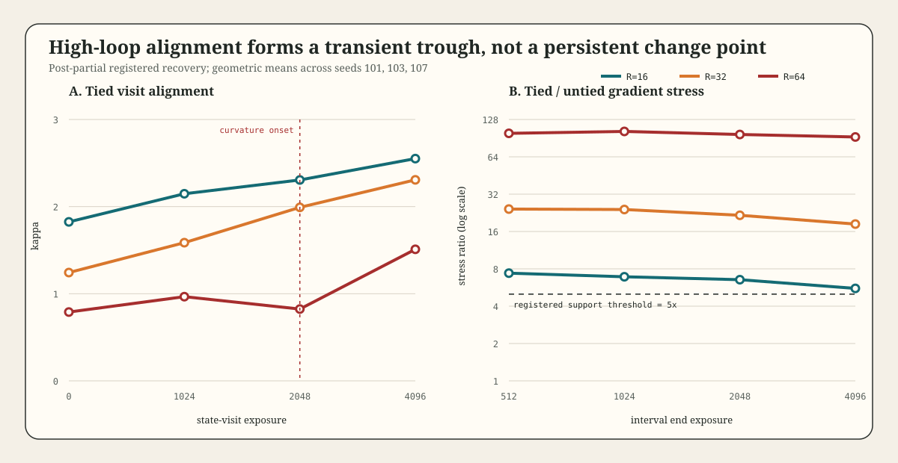

# Kappa Surface v1: Post-Partial Recovery Result

## Result

The registered classification is **`form_unresolved`**.

This is a conflict between two passing diagnostics, not an absence of structure:

- The global separable surface is the registered model winner: AICc `-39.107`, a `4.165` advantage over the smooth interaction, with blocked-CV RMSE ratio `0.869`.
- The paired local diagnostic detects a preterminal high-depth curvature onset at exposure `2048`: `C=-0.736`, 95% paired-seed bootstrap interval `[-1.416,-0.296]`.
- At that onset, the tied-to-untied interval-gradient stress ratio is `96.891` for `R=64`, versus `21.620` for `R=32` and `6.541` for `R=16`.
- The `R=64` change-point model does not win. Its AICc is `-26.435` and blocked-CV RMSE is `0.2192`, versus `0.1950` for the separable model.

The registered transition branch requires the `R=64` change-point model to win, so it does not fire. The registered smooth branch requires no local onset, so it also does not fire. Relabeling the result after seeing this conflict would defeat the protocol.

## Surface

Geometric-mean tied kappa across seeds 101, 103, and 107:

| R | E=0 | E=1024 | E=2048 | E=4096 |
|---:|---:|---:|---:|---:|
| 16 | 1.825 | 2.148 | 2.306 | 2.551 |
| 32 | 1.243 | 1.586 | 1.991 | 2.307 |
| 64 | 0.790 | 0.966 | 0.824 | 1.510 |

The high-depth curve is transiently nonmonotonic. It falls between exposures 1024 and 2048, then rebounds by 4096. This explains the model conflict: the preregistered `R=64` alternative is linear in the transformed training coordinate and represents a persistent depth-specific deviation, not a localized trough with recovery.

Depth curvature is

`C(E) = log(kappa64(E)) - 2 log(kappa32(E)) + log(kappa16(E))`.

| Exposure | C(E) | 95% interval | Registered role |
|---:|---:|---:|---|
| 0 | -0.070 | [-0.971, 0.423] | initialization diagnostic |
| 1024 | -0.192 | [-0.600, 0.346] | no onset |
| 2048 | -0.736 | [-1.416, -0.296] | onset detected |
| 4096 | -0.324 | [-0.739, 0.027] | known-direction terminal diagnostic |

The onset is localized: its interval excludes the practical-equivalence region at 2048, while the terminal interval again crosses zero.

## Optimization Stress

Tied-to-untied ratios of geometric-mean interval maximum gradient norm:

| Interval end | R=16 | R=32 | R=64 |
|---:|---:|---:|---:|
| 512 | 7.385 | 24.267 | 98.974 |
| 1024 | 6.904 | 24.068 | 102.531 |
| 2048 | 6.541 | 21.620 | 96.891 |
| 4096 | 5.564 | 18.368 | 92.515 |

Gradient co-localization passes at the curvature onset. The ratios are also depth ordered at every interval. This supports an optimization-state association, but the registered claim boundary blocks a causal statement: the experiment does not intervene on gradient stress independently of depth or tying.

## Integrity Controls

- Tied terminal replication: passed for all nine `R`-by-seed cells; maximum absolute log ratio is exactly `0.0`.
- Sealed untied terminal point equivalence: passed; six-depth untied gamma is `0.024572`, within `[-0.1,0.1]`.
- Original untied trajectory control: unobserved by design in the labeled recovery. Recovery 2 measures matched untied gradients but does not restore the original five-checkpoint untied-kappa requirement.
- Failed untied attempt admission: zero records.
- Combined canonical record count: 81.

## Recovery Chain

1. Original attempt: the outer command host timed out before the wrapper finalizer. Thirty-one events were observed, but only six complete tied `R=16/R=32` cells were admitted later. The incomplete `R=64` cell was excluded entirely.
2. Recovery 1 tied phase: all three `R=64` tied cells completed with exact terminal replication.
3. Recovery 1 untied phase: aborted at peak I/O `80.99 MB/s` after three sustained cap violations; no partial gradient record was admitted.
4. Recovery 2: all nine untied cells were rerun with a two-second post-checkpoint delay. Peak I/O fell to `42.331 MB/s` without changing the 50 MB/s cap or any scientific field.

Conservative outcome-producing execution is `1964.109 s` against the 3600-second aggregate cap. Including the deterministic finalizer, the wrapper clock is `1972.722 s`. Cleanup passed after every finalized phase.

## Artifact Receipts

- Recovery 2 config SHA-256: `167182d2476249df5abf25701d0de9c49cd1610612d4aceaffcd9de18254a43e`
- Tied `R=64` records SHA-256: `be1d78147fc5abc9c1844c3d534e4b13665bbca97807d0c6b7c42e578e808a43`
- Paced untied records SHA-256: `1b797c9841c7e7857612b79f8723d0eed7da885953fd701b6734a6c65e2f5749`
- Combined records SHA-256: `69c1b1ded04426159d0da666ca34a2eaa22ff53ea3a13b0843775ec512dc9409`
- Result SHA-256: `cf6835e56d38a8255c0c66e650e6871e63feb49e95988c604c8e4ec49e714597`
- Final receipt SHA-256: `294d06ede48cb7a2b6ef48bcd6db75afd3028305edbe20a5cb9503d7fde76cd8`
- Finalizer resource receipt SHA-256: `3a8a987da93122b11b4e4455f578679d49b449fc6bc2a9ec89f5c6f40cc81b7c`
- Figure SHA-256: `c41153825310a9a5633b6d4413520fce62ae07c68bb17a8c9630720a116c4cd8`

## Licensed Claim

In this small weight-tied residual-loop construction, visit alignment is both training-state dependent and nonmonotonic across loop depth. A transient `R=64` alignment trough appears at exposure 2048 alongside approximately 97-fold tied-to-untied gradient stress, but the preregistered persistent change-point model loses to a simpler global surface. The mechanism form therefore remains unresolved.

## Next Test

The next experiment should not refit these outcomes and call the trough confirmed. Register a transient-depth model before new data, for example a smooth base surface plus one fixed-width negative `R=64` pulse in training time, then test it on new seeds or a second task family. A successful model must predict both trough location and rebound and still beat the separable baseline under blocked predictive scoring.
