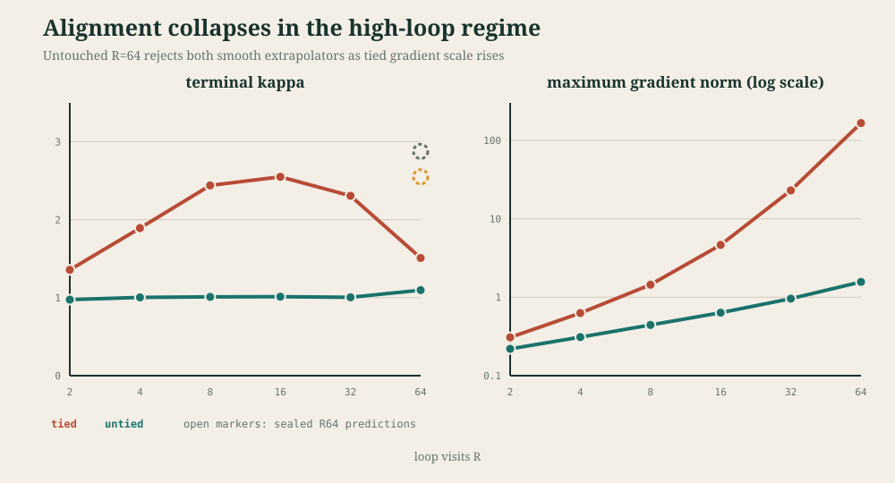
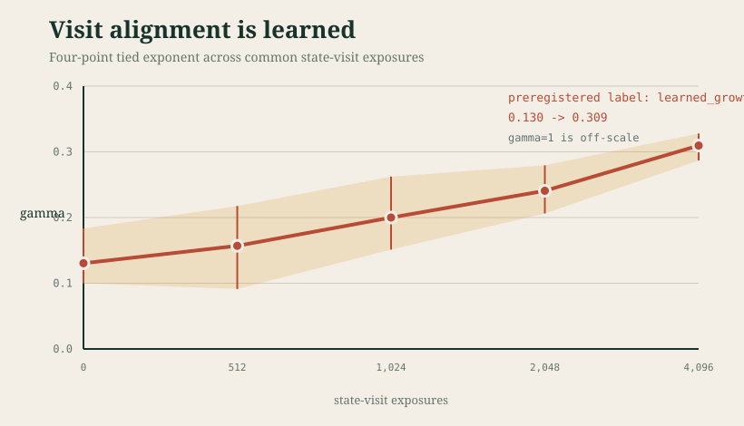
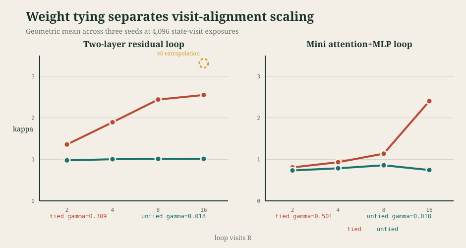
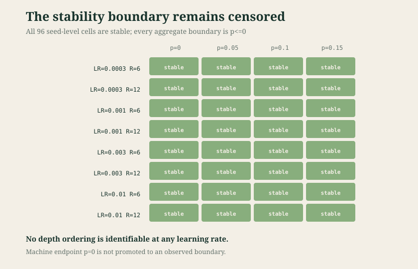

# Loop Schedule Algebra v0.1: Visit Alignment Is Learned but Nonmonotonic

## Abstract

Repeated use of one parameterized block changes how its update is accumulated
and read through an unrolled computation. DeepLoop formalizes this effect with
a visit-alignment coefficient `kappa_R`, but leaves direct measurement of the
coefficient as future work. We estimate visit alignment in small tied residual
loops by combining per-visit suffix sensitivities with gradients from
recomputations in which exactly one application has live parameters.

At a fixed loop count, alignment is learned: a four-point descriptive exponent
over `R={2,4,8,16}` rises from `0.130` at initialization to `0.309` after 4,096
state-visit exposures. Across larger loop counts, however, the coefficient is
not a stable power law. The original terminal three-point fit had
`gamma=0.423` and `R^2=0.994`; adding `R=16` reduced the same-horizon fit to
`0.309`, and a sealed addendum found tied geometric-mean kappa `2.307` at
`R=32` and `1.510` at untouched `R=64`. The `R=64` result missed both a sealed
saturating-exponential prediction (`2.551`) and logarithmic prediction
(`2.877`), returning the registered classification `form_unresolved`.

The high-loop decline coincides with tied maximum gradient norms of
`149-166`, versus at most `1.565` in matched untied controls, while all losses
remain finite and decrease. A mini causal attention+MLP loop independently
shows tied `gamma=0.501` versus untied `0.018`. Its registered composite gate
fails because it requires a high-quality power law from an intended flat null;
a labeled post-hoc seed bootstrap gives the untied interval
`[-0.092,0.077]`. Finally, all 96 residual-scaling ladder cells through
`R=12` remain stable down to `p=0`, leaving that boundary censored.

The results reject `gamma=1` as a descriptive constant in these small loops,
not as a conservative envelope. They also reject both registered smooth
high-loop extrapolators. They do not establish asymptotic saturation,
language-model performance, or a general stability threshold.



## Measurement

For each gradient-visible visit `r`, let `U_r` be a top-direction JVP through
the suffix after that visit and `G_r` the parameter gradient from a recomputed
loss where only that application has live parameters. The scale-free
coefficient is

```text
kappa_g = ||sum_r U_r|| ||sum_r G_r||
          / (R_g max_r ||U_r|| max_r ||G_r||),    0 <= kappa_g <= R_g.
```

The schedule-visible stability functional is

```text
B(A) = sum_j J_j R_g(j) kappa_g(j) (beta_j / alpha_j)^2.
```

Using `R_g` rather than the forward visit count `R` matters when
backpropagation is truncated or parameter applications are frozen. Residual
scale is excluded from kappa and applied once in `B(A)`.

For descriptive scaling diagnostics we fit

```text
log(kappa_R) = c + gamma log(R)
```

to geometric-mean kappas across seeds `{101,103,107}`. The high-loop addendum
instead preregistered two raw-kappa curves, a saturating exponential
`K-A exp(-R/tau)` and logarithmic growth `a+b log R`, because the `R=16`
residual had already rejected transfer of the three-point power law.

## Alignment During Training

| Exposures | gamma over R={2,4,8,16} | R-squared | 95% bootstrap interval |
|---:|---:|---:|---:|
| 0 | 0.1304 | 0.6116 | [0.1000, 0.1834] |
| 512 | 0.1570 | 0.6829 | [0.0913, 0.2176] |
| 1,024 | 0.2000 | 0.8214 | [0.1511, 0.2624] |
| 2,048 | 0.2406 | 0.8564 | [0.2062, 0.2794] |
| 4,096 | 0.3095 | 0.9140 | [0.2868, 0.3278] |

The exponent increases by `0.1790`, and all four transitions are
nondecreasing. Under the frozen rule, this is `learned_growth`. Early fits are
weak, so the more precise mechanism statement is that cross-visit alignment
and its coherence across these four loop counts accumulate during training.



### Reconciliation of 0.423 and 0.309

The v0 and v0.1 terminal `R={2,4,8}` kappas are byte-for-byte identical under
the fixed probe direction. Both estimates use the same 4,096-exposure horizon,
batch size, learning rate, hidden size, residual scaling, and five power
iterations. The difference is support, not time or a failed replication:

- `gamma=0.422909`, `R^2=0.994025`: terminal fit on `R={2,4,8}`.
- `gamma=0.309485`, `R^2=0.914049`: terminal refit after adding `R=16`.

The held-out `R=16` kappa was `2.550934`, below the sealed `3.315221`
prediction (ratio `0.769461`). The added residual changes the descriptive fit.
Neither exponent is treated as a time-invariant architectural constant.

## Attention+MLP Replication

The second family uses manual multi-head causal attention and a two-layer GELU
MLP inside one explicit outer residual, trained on deterministic prefix-context
regression at the same exposure budget.

| Regime | gamma | R-squared | Kappa at R=16 |
|---|---:|---:|---:|
| tied | 0.5012 | 0.8540 | 2.4021 |
| untied | 0.0179 | 0.0509 | 0.7426 |

The tied-minus-untied contrast is `0.483387`. The registered composite gate
nonetheless fails because it requires both fits to have `R^2>=0.8`. That is a
gate misspecification, not an evidence failure: an intended flat null has
negligible slope and need not produce a meaningful power-law `R^2`.

A labeled post-hoc 20,000-draw seed bootstrap puts the untied gamma interval at
`[-0.092064,0.077037]`, containing zero, with point magnitude below `0.1`.
This diagnoses the registered gate; it does not retroactively turn the failed
gate into preregistered confirmation. Future null controls should use a
predeclared equivalence region rather than goodness-of-fit to a power law.



## High-Loop Holdout

After observing `R=16`, a labeled addendum registered two models before new
outcomes. `R=32` joined the fit set; both `R=64` predictions were then committed
and pushed before the holdout runner could construct an `R=64` cell.

| R | Tied kappa | Untied kappa | Local tied gamma |
|---:|---:|---:|---:|
| 2 | 1.357966 | 0.975547 | - |
| 4 | 1.893620 | 1.003657 | 0.479699 |
| 8 | 2.440651 | 1.011517 | 0.366119 |
| 16 | 2.550934 | 1.013226 | 0.063760 |
| 32 | 2.307170 | 1.005582 | -0.144901 |
| 64 | 1.509898 | 1.097438 | -0.611674 |

The sealed `R=64` predictions and errors were:

| Candidate | Prediction | Absolute error |
|---|---:|---:|
| saturating exponential | 2.551038 | 1.041141 |
| logarithmic | 2.876785 | 1.366887 |

The saturating predictor is closer, but its winner-to-loser error ratio
`0.761687` misses the registered `<=0.75` requirement. Its fit also misses the
registered `R^2>=0.9` requirement and the measured tail violates the monotone
growth floor. The result is therefore `form_unresolved`. It does not support a
smooth asymptotic ceiling.

All tied `R=64` runs remained finite and reduced loss, but maximum gradient
norms were `149.466`, `165.824`, and `160.771`. Matched untied runs remained at
or below `1.565`. This makes a depth-by-training-state transition a live
hypothesis: kappa may decline because the trained high-loop dynamics have
entered a different regime, not because a stationary saturating law has been
identified. The next measurement should be the two-dimensional surface
`kappa(R,t)` with denser early checkpoints at `R={16,32,64}`.

The six-point untied point exponent is only `0.024572`, but its narrow
bootstrap interval `[0.018400,0.033191]` excludes exact zero, so the addendum's
registered flatness conjunction fails. This is another reason to preregister
practical equivalence rather than require a confidence interval to contain a
point null.

## Stability Ladder

The extension tests `p={0,0.05,0.10,0.15}` across learning rates
`{0.0003,0.001,0.003,0.01}` and `R={6,12}`. All 96 seed-level runs remain
stable. Maximum gradient norm is `66.07` against a cutoff of `100`; maximum
final/initial loss ratio is `0.686` against a cutoff of `10`. Every boundary is
left-censored at `p<=0`, so the proposed depth ordering is non-identifying.



This result and the `R=64` stress are not inconsistent: the registered ladder
stopped at `R=12`, whereas the high-loop addendum exposes a different regime.

## Interpretation

1. Weight tying creates measurable visit alignment. Both model families show
   positive tied scaling over `R={2,4,8,16}` and near-zero untied point slopes.
2. Alignment is learned at fixed loop counts. It is positive at initialization
   and grows over 4,096 state-visit exposures.
3. Alignment is not a single power-law constant across loop count. The
   three-point `0.423` estimate fails at `R=16`, and both registered smooth
   high-loop alternatives fail at untouched `R=64`.
4. The high-loop decline is nonmonotonic and coincides with much larger tied
   gradients. Smooth saturation is not established; a regime transition is a
   hypothesis for a future `kappa(R,t)` experiment.
5. The fully aligned `gamma=1` envelope is conservative rather than
   descriptive in the measured regime. We reject it as a measured constant,
   not as a sufficient bound.

If kappa were eventually bounded, its local effective exponent would tend to
zero and the DeepLoop threshold expression would tend toward `p=1/4`. The
present addendum does not establish that premise. Even under bounded kappa,
the explicit `R_g` factor remains in `B(A)`, so total depth-dependent stability
cost does not automatically vanish. The `R=64` gradients make that distinction
empirical rather than merely algebraic.

DeepLoop explicitly calls for direct measurement of `kappa_R` or cross-round
alignment. To our knowledge, this is the first direct estimate of its specific
visit-alignment coefficient, scoped to the literature audit recorded in this
repository rather than an exhaustive survey.

## Limits

The primary model is a two-linear-layer residual loop at hidden size 128. The
attention+MLP cell is small, uses deterministic regression rather than language
modeling, and changes task and block family together. Three seeds expose large
high-loop variance but cannot characterize its distribution. The `R=64`
gradient norms are diagnostics, not a preregistered divergence endpoint. No
result licenses a claim about downstream accuracy, sample efficiency,
large-scale Transformers, asymptotic saturation, or DeepLoop's empirical GPT
results.

## Reproducibility

- LSA v0.1 config SHA-256:
  `c6cd78a09909956962a2c6d585270807088a9b8b0dc5e1e69fc8b151d45882cc`
- LSA v0.1 receipt SHA-256:
  `3fa8c1e6f360035a8d1fc17932d18b2c6fe0249e6653c6e5aa9992a5cdf57414`
- Saturation-addendum config SHA-256:
  `f4eb1cd7d1df7a18f523498ed48a159ccc2f123c80957913301c51cc1cc30894`
- Saturation-addendum receipt SHA-256:
  `425e97fde47eb40b5baac381118ae95c77531b09083d2f847ee689951860b557`
- Sealed prediction SHA-256:
  `910f4d994be6d24afb8bb370b9b6e42a2b907df7b4b82245516286295119ed42`
  at commit `d91b745007c25bc01403aa12b67de73acb969c77`.
- Post-hoc external-flatness receipt SHA-256:
  `f50badf7f496229598314d3dcf2ebe340f3f9eaa1d660f8a16c310495ea6bbae`.
- Valid records: 42 replay, 72 primary, 24 attention+MLP, 96 ladder, 6
  `R=32`, and 6 untouched `R=64`.
- Saturation-addendum training-phase runtime: `318.354 s`; all resource and
  cleanup receipts pass.

Primary reference: Shuzhen Li, Yifan Zhang, Jiacheng Guo, Quanquan Gu, and
Mengdi Wang, [DeepLoop: Depth Scaling for Looped Transformers](https://arxiv.org/abs/2607.13491),
arXiv:2607.13491, 2026.
