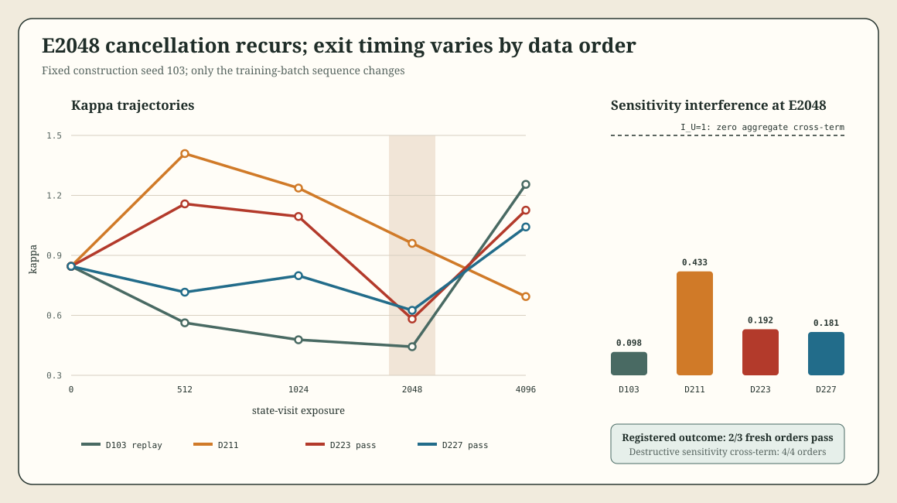

# Loop-Schedule Kappa Data-Order Intervention v0.2.1

## Result

The frozen bookkeeping outcome is **`persists_under_data_order_reseed`**: two of three fresh training-order seeds satisfy the registered `E=2048` trough-and-recovery rule. The order-103 replay matches the sealed parent exactly at all four parent kappa checkpoints (`maximum absolute difference = 0`).

| Order seed | K1024 | K2048 | K4096 | Log drop | Log rebound | Registered shape |
|---:|---:|---:|---:|---:|---:|---|
| 103 replay | 0.477801 | 0.443089 | 1.255193 | -0.0754 | +1.0413 | absent |
| 211 | 1.236716 | 0.960244 | 0.693992 | -0.2530 | -0.3247 | absent |
| 223 | 1.094448 | 0.581698 | 1.125972 | -0.6321 | +0.6604 | pass |
| 227 | 0.798553 | 0.625003 | 1.042084 | -0.2450 | +0.5112 | pass |

The strict scientific interpretation is more nuanced than the branch label. Two independent new orders reproduce the practical trough and recovery, so the phenomenon is not explained by one anomalous original stream. Order 211 supplies a retained right-censored counterexample: kappa drops at `E=2048` and continues downward through the registered `E=4096` horizon, but later recovery was not observed. The replay cell has a local `E=2048` minimum and strong rebound but misses the practical drop threshold (`-0.0754` versus `-0.1`). Thus an order-invariant exit trajectory is unsupported within the observed horizon. We call the descriptive pattern **shared cancellation with order-conditioned exit**. The stronger causal name *intrinsic cancellation, extrinsic recovery* remains a splice-test hypothesis.

## Robust Mechanism

The cancellation diagnostic is more stable than the full trajectory rule:

| Order seed | Sensitivity `I_U` at E2048 | Gradient `I_G` at E2048 |
|---:|---:|---:|
| 103 | 0.097683 | 37.330046 |
| 211 | 0.433269 | 36.511398 |
| 223 | 0.191988 | 34.292099 |
| 227 | 0.180586 | 36.982146 |

Every order has `I_U<1`, proving a negative aggregate suffix-sensitivity cross-term, while every gradient channel remains strongly constructive. The robust result is therefore not “every order produces the same trough.” It is: **all four orders enter destructive suffix-sensitivity interference at the registered exposure, while only two of three fresh orders recover with the preregistered practical shape.**

## Confound Resolution

Three increasingly broad data explanations are now separable:

1. A single shared item at `E=2048` is structurally impossible because batches are step-indexed and `R=64` and `R=128` use different streams there.
2. A single anomalous order is disfavored because fresh orders 223 and 227 reproduce the registered shape and all four orders reproduce destructive sensitivity interference.
3. Data order is irrelevant is rejected descriptively within the registered horizon: order 211 has not recovered by `E=4096`, and the fixed-construction trajectories differ substantially.

The licensed conclusion is a reproducible cancellation mechanism with order-conditioned exit through `E=4096`, not a claim that order 211 never recovers or causal identification of an intrinsic stability boundary.

## Recovery Disclosure

All four cells completed under the frozen caps in `767.664 s`, but the original result assembler failed because it required equality between the new five-point kappa grid and the sealed parent's four-point kappa grid. The source records were committed untouched before a no-training recovery was registered. Recovery admitted exactly 20 hashed records, compared replay on all and only the parent kappa checkpoints, retained the new `E=512` point, and changed no scientific threshold or branch.

Training peak RAM was `931.625 MB`, peak I/O was `14.494 MB/s`, and cleanup passed. Recovery analysis and finalization also passed cleanup. Total accounted execution through finalization was `789.607 s` against the frozen one-hour aggregate cap.

## Claim Boundary

This is one post-outcome-selected small residual-loop construction at `R=64`, three fresh data orders, eight AdamW updates, and one synthetic task family. It establishes neither an intrinsic or asymptotic stability boundary nor transfer to Transformers or task performance. The `R^2.12` stress exponent from v0.2 is unaffected because that estimate did not depend on this order-reseed classification.

## Next Test

First, continue order 211 beyond `E=4096` to resolve the right-censoring and run a registered checkpoint splice: apply recovering-order suffixes to the order-211 `E=2048` model/optimizer state, plus a reciprocal order-211 suffix on a recovering state. This distinguishes suffix-controlled exit from pre-`E=2048` path dependence. Then replace post-outcome construction selection with a crossed design over construction bundles `{101,103,107}` and fresh data-order seeds `{211,223,227}`.
