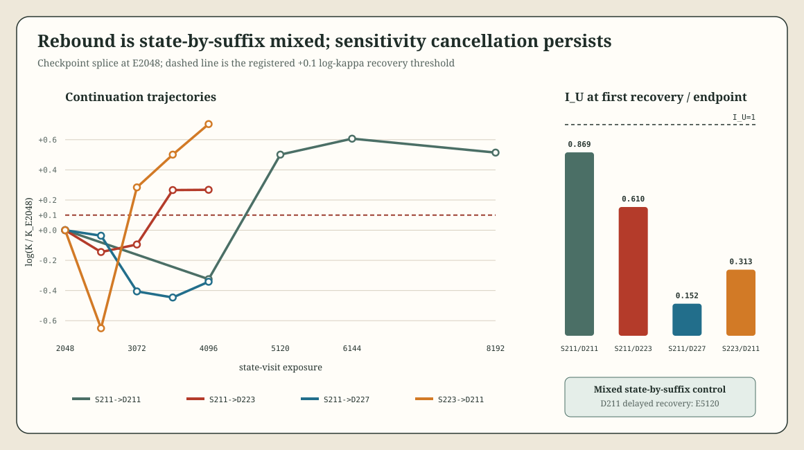

# Loop-Schedule Kappa Checkpoint Splice v0.2.2

## Result

The exact replay gate passed: continuing the sealed order-211 `E=2048` checkpoint with its original streams reproduced the `E=4096` model and complete AdamW state tensor-exactly, with kappa difference `0.0`.

The registered splice outcome is **`mixed_state_suffix_control`**. The right-censored order-211 trajectory is **delayed recovery by `E=5120`**, the first measured checkpoint after the prior `E=4096` horizon.

| Source state | Suffix order | Endpoint | Log K/K2048 | First measured recovery | Outcome |
|---:|---:|---:|---:|---:|---|
| 211 at E2048 | 223 | E4096 | +0.2678 | E3584 | transfers |
| 211 at E2048 | 227 | E4096 | -0.3418 | none by E4096 | does not transfer by horizon |
| 223 at E2048 | 211 | E4096 | +0.7036 | E3072 | reciprocal recovery |
| 211 at E4096 | 211 | E8192 | +0.5146 | E5120 | delayed original recovery |

Neither simple causal model fits. Suffix 223 accelerates rebound from state 211, but suffix 227 does not despite producing recovery on its original state. Conversely, suffix 211 supports rapid rebound from state 223 even though the same suffix on state 211 is delayed until `E=5120`. Post-trough data matters, but its effect depends on the checkpoint reached before the splice.

## Mechanism Revision

Kappa recovery is not exit from destructive sensitivity interference. At each first recovery checkpoint:

| Arm | Checkpoint | `I_U` | `I_G` |
|---|---:|---:|---:|
| 211 state / 223 suffix | E3584 | 0.609795 | 35.424772 |
| 223 state / 211 suffix | E3072 | 0.312994 | 34.037021 |
| unchanged 211 | E5120 | 0.868681 | 34.251274 |

The non-transferring 211-state/227-suffix arm remains more deeply destructive at `E=4096` (`I_U=0.151899`, `I_G=35.970167`). Unchanged order 211 also remains below the zero-cross-term threshold through `E=8192` (`I_U=0.576704`) despite sustained kappa recovery.

The robust positive name is therefore **persistent cancellation with interaction-controlled rebound**. The gradient channel remains strongly constructive in every arm, supporting the scoped interpretation that this geometry lives in the functional sensitivity metric rather than parameter-gradient conflict. The model can regain aggregate kappa magnitude without eliminating negative sensitivity cross-terms.

## Censoring Resolution

The prior phrase “not recovered by `E=4096`” was correctly right-censored. Continuing the exact sealed order-211 checkpoint with unchanged streams gives:

| Exposure | Kappa | `I_U` |
|---:|---:|---:|
| 4096 | 0.693992 | 0.178336 |
| 5120 | 1.584952 | 0.868681 |
| 6144 | 1.761691 | 0.966214 |
| 8192 | 1.606381 | 0.576704 |

Recovery time, not eventual recovery within the tested horizon, is order-dependent in the original four traces: all four have crossed the frozen kappa threshold by `E=5120` or earlier.

## Claim Boundary

The splice causally intervenes on deterministic suffix identity while holding a source model-plus-optimizer checkpoint fixed, and the reciprocal arm demonstrates checkpoint dependence. It does not yet separate model representation state from AdamW moment state, identify a single causal batch, or generalize beyond this post-outcome-selected `R=64` construction and synthetic task.

## Successor Result

The registered checkpoint-component split is complete; see [Loop-Schedule Kappa State/Moment Decomposition v0.2.3](loop_schedule_kappa_state_moment_v0_2_3.md). Neither representation-only nor moment-only control survives the full crossing. The result is `factorial_unresolved`: the three-way model-by-moment-by-suffix interaction (`+0.5280`) and model-weight main effect (`+0.5031`) are nearly tied, and swapping AdamW state reverses suffix preference under the 211 model weights.
