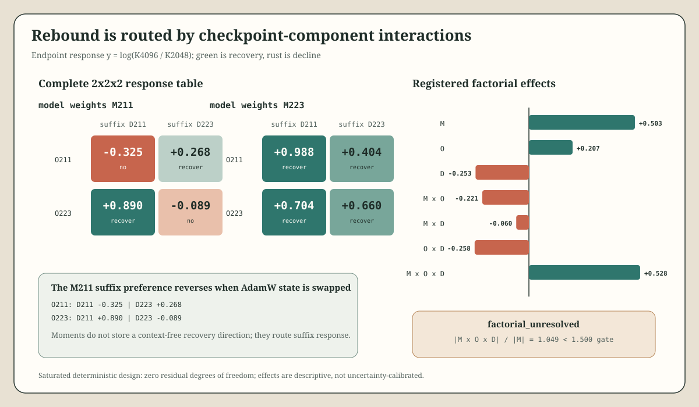

# Loop-Schedule Kappa State/Moment Decomposition v0.2.3

## Result

The registered outcome is **`factorial_unresolved`**. The largest descriptive effect is the model-weight by optimizer-moment by suffix interaction (`M x O x D = +0.5280`), but the model-weight main effect is nearly as large (`M = +0.5031`). Their absolute-effect ratio is `1.049`, below the frozen `1.5` dominance gate.

| Model weights | AdamW state | Suffix | Log K4096/K2048 | Endpoint K | `I_U` | `I_G` | Recovery |
|---:|---:|---:|---:|---:|---:|---:|:---:|
| 211 | 211 | 211 | -0.3247 | 0.6940 | 0.1783 | 34.5660 | no |
| 211 | 211 | 223 | +0.2678 | 1.2552 | 0.5633 | 35.4684 | yes |
| 211 | 223 | 211 | +0.8896 | 2.3373 | 1.8658 | 34.8226 | yes |
| 211 | 223 | 223 | -0.0892 | 0.8783 | 0.2181 | 36.2206 | no |
| 223 | 211 | 211 | +0.9879 | 1.5622 | 1.0269 | 34.5056 | yes |
| 223 | 211 | 223 | +0.4041 | 0.8713 | 0.2801 | 35.2329 | yes |
| 223 | 223 | 211 | +0.7036 | 1.1756 | 0.5846 | 34.0492 | yes |
| 223 | 223 | 223 | +0.6604 | 1.1260 | 0.4988 | 35.1263 | yes |

Four unswapped controls come from the sealed v0.2.1/v0.2.2 artifacts. Four new crossed cells passed tensor-exact pre-continuation gates for the selected model weights and complete AdamW state, including first moments, second moments, and step counters.

## Factorial Structure

| Term | Effect | Absolute rank |
|---|---:|---:|
| `M x O x D` | +0.5280 | 1 |
| model weights `M` | +0.5031 | 2 |
| `O x D` | -0.2577 | 3 |
| suffix `D` | -0.2533 | 4 |
| `M x O` | -0.2213 | 5 |
| AdamW state `O` | +0.2073 | 6 |
| `M x D` | -0.0602 | 7 |

The sharpest cell-level result is a full suffix-preference reversal under fixed model weights `M211`. With the original `O211` moments, suffix `D223` recovers and `D211` declines (`+0.2678` versus `-0.3247`). Swapping only complete AdamW state to `O223` reverses that ordering: `D211` recovers strongly and `D223` declines (`+0.8896` versus `-0.0892`).

The same optimizer swap is not globally recovery-promoting. Under `M223`, both moment states recover under both suffixes, and their orderings differ from the `M211` regime. AdamW state therefore does not carry a context-free rebound instruction. Its effect is conditional on both the model representation reached by `E=2048` and the subsequent data suffix.

The positive scoped name is **checkpoint-component-conditioned sensitivity routing**. Model weights set a broad response regime; optimizer moments and the data suffix jointly route rebound within it. This refines v0.2.2's "persistent cancellation with interaction-controlled rebound" without reducing the checkpoint to either representations or moments alone.

## Interference Channels

Every endpoint retains a strongly constructive gradient channel, `I_G in [34.05, 36.22]`. Functional sensitivity is heterogeneous: six cells remain below `I_U=1`, while `M211/O223/D211` reaches `I_U=1.866` and `M223/O211/D211` reaches `1.027`.

This means rebound can still occur under destructive sensitivity cancellation, but selected component/suffix combinations can also route the system into constructive functional interference. The stable gradient channel rules out a simple parameter-gradient-conflict account within this construction.

## Recovery Audit

Attempt 1 completed all science outputs but its controlling tool session ended before the wrapper wrote a resource receipt. It is retained byte-for-byte as unsealed evidence and is not the primary result.

The unchanged recovery run charged a conservative `620 s` for attempt 1, completed in `662.195 s`, and stayed within the frozen caps: peak RAM `934.559 MB`, peak I/O `9.201 MB/s`, no measured owned-process VRAM, and cleanup passed with no lingering owned process or GPU app. Its 16-record JSONL is byte-identical to attempt 1 (`ee1d17c1...ebd7ce1`), normalized science summaries match exactly, and all four terminal model-plus-AdamW checkpoints are byte-identical and tensor-exact.

## Claim Boundary

This is a saturated deterministic `2x2x2` design with one cell per combination and zero residual degrees of freedom. The factorial effects are descriptive; the experiment cannot estimate uncertainty, identify which AdamW tensor or batch is causal, or generalize beyond this post-outcome-selected `R=64` synthetic residual-loop construction. It makes no Transformer, task-performance, asymptotic-depth, or optimizer-general claim.

## Next Test

Replicate the full decomposition at new construction and data-order seeds before splitting first and second AdamW moments. The preregistered question should be whether the model-by-moment-by-suffix interaction preserves its sign and practical magnitude across constructions; only then is a finer moment-tensor intervention worth interpreting.
