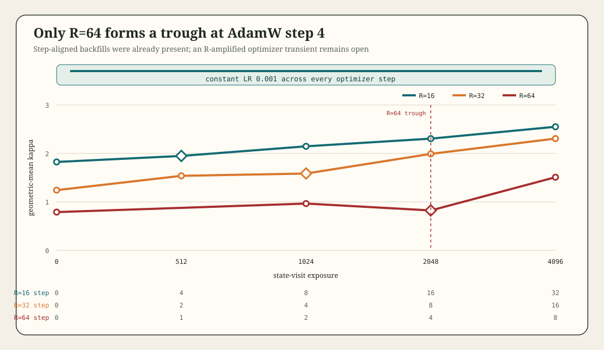

# Kappa Surface v1: Optimizer-Schedule Confound Audit

## Verdict

The transient `R=64` alignment trough is not explained by an explicit learning-rate warmup, decay, or schedule knee. The frozen runner uses AdamW with a constant learning rate of `0.001`, and its execution path contains no scheduler or warmup operation.

This audit does not establish that the trough is intrinsic to the loop dynamics. AdamW's moment estimates and bias correction remain optimizer-state mechanisms, and the experiment does not intervene on them independently. It rules out the narrower and immediately testable confound that a registered learning-rate transition occurred near exposure `2048`.

## Frozen Execution

The Recovery 2 config fixes:

- optimizer: `adamw`
- learning rate: `0.001`
- weight decay: `0.0`
- batch size: `8`
- state-visit target: `4096`
- loop depths: `R in {16,32,64}`

The runner constructs `torch.optim.AdamW` once, calls `optimizer.step()` once per batch, and never constructs or advances a scheduler. State-visit exposure advances by

`E = optimizer_step * batch_size * R`.

Therefore the registered checkpoints map to optimizer steps as follows:

| Exposure | R=16 | R=32 | R=64 |
|---:|---:|---:|---:|
| 0 | 0 | 0 | 0 |
| 1024 | 8 | 4 | 2 |
| 2048 | 16 | 8 | 4 |
| 4096 | 32 | 16 | 8 |

Exposure `2048` is not a common optimizer step. Conversely, optimizer step `4` occurs at exposures `512`, `1024`, and `2048` for `R=16`, `R=32`, and `R=64`, respectively.

## Data Discriminator

Geometric-mean tied kappa is monotonic over the four registered surface points for `R=16` and `R=32`:

| R | E=0 | E=1024 | E=2048 | E=4096 | Shape |
|---:|---:|---:|---:|---:|---|
| 16 | 1.825 | 2.148 | 2.306 | 2.551 | monotonic growth |
| 32 | 1.243 | 1.586 | 1.991 | 2.307 | monotonic growth |
| 64 | 0.790 | 0.966 | 0.824 | 1.510 | trough and recovery |

The excursion is thus not pinned at exposure `2048` across depth. It is also not pinned at optimizer step `4`: `R=32` rises through its step-4 measurement at exposure `1024`, while `R=64` reaches the trough at step 4 and exposure `2048`.

The seed-level `R=64` values are heterogeneous, but the registered paired curvature interval at exposure `2048` excludes zero. This audit does not relabel that registered result or claim a new model family from the same outcomes.

## Stress Scaling

At the registered curvature onset, tied-to-untied interval-gradient stress is `6.541x`, `21.620x`, and `96.891x` for `R=16`, `R=32`, and `R=64`. The local two-point exponent from `R=32` to `R=64` is

`log2(96.891 / 21.620) = 2.164`.

Across `R=16` to `R=64`, the corresponding endpoint exponent is `1.944`. These are descriptive slopes over two or three depths, not an established stress scaling law. They motivate a held-out `R=128` transient-prognostic test but do not license it without a new frozen protocol.

## Scope

The completed alignment v0.1 note remains unchanged. Its perimeter is learned alignment, bounded terminal depth dependence, and envelope rejection. The recovered excursion remains a separate v0.2 candidate until a preregistered transient model predicts onset, depth, and recovery on new data.
