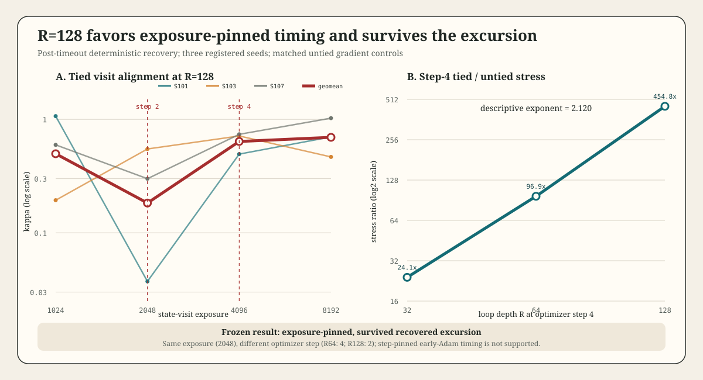

# Loop-Schedule Kappa Transient v0.2

## Result

The frozen three-seed `R=128` endpoint is **`exposure_pinned`** and the system **survived a recovered excursion**.

The geometric-mean trajectory is:

| Exposure | Optimizer step | Geometric kappa |
|---:|---:|---:|
| 1024 | 1 | 0.497605 |
| 2048 | 2 | 0.182968 |
| 4096 | 4 | 0.638521 |
| 8192 | 8 | 0.694384 |

The registered log changes are `-1.0005`, `+1.2498`, and `+0.0839`. The exposure-pinned rule requires a drop of at least `0.1` at `E=2048` followed by a rebound of at least `0.1` at `E=4096`; both margins pass by more than one log unit. The step-pinned rule requires a step-4 drop and does not fire.

## Mechanism Read

The original `R=64` trough occurred at `E=2048`, AdamW step 4. At `R=128`, the trough remains at `E=2048` even though that is AdamW step 2. This rejects the preregistered prediction that the excursion onset is pinned to the first four optimizer updates. It favors an exposure-indexed, loop-depth-dependent transient over an early-Adam timing artifact.

This is not causal identification of a stability boundary. Learning-rate schedule confounding was ruled out earlier, and step-pinned optimizer timing now loses prospectively, but optimizer state was not independently intervened on. The licensed statement is that the transient tracks state-visit exposure across `R=64` and `R=128`, survives at `R=128`, and recovers by step 4 while remaining recovered at step 8.

## Seed Variance

| Seed | E=1024 | E=2048 | E=4096 | E=8192 | Per-seed rule |
|---:|---:|---:|---:|---:|---|
| 101 | 1.067760 | 0.037271 | 0.494096 | 0.700279 | exposure-pinned |
| 103 | 0.193642 | 0.548293 | 0.713820 | 0.466505 | unresolved |
| 107 | 0.595911 | 0.299740 | 0.738117 | 1.024879 | exposure-pinned |

Two of three seeds independently satisfy the exposure-pinned shape; seed 103 does not. Leave-one-seed-out geometric classification is exposure-pinned for `{101,103}` and `{101,107}` but unresolved for `{103,107}`. The registered full-ensemble endpoint is decisive, but its seed sensitivity prevents a universal per-seed claim.

## Stress Scaling

Matched tied-to-untied interval-maximum gradient ratios at optimizer step 4 are:

| R | Exposure at step 4 | Stress ratio |
|---:|---:|---:|
| 32 | 1024 | 24.0678x |
| 64 | 2048 | 96.8908x |
| 128 | 4096 | 454.8110x |

The three-depth log-log exponent is `2.1200`. The adjacent slopes are `2.0093` from `R=32->64` and `2.2308` from `R=64->128`. The previously descriptive two-point escalation therefore persists with a third depth, but this remains a small-scale, single-task exponent rather than an asymptotic law.

At `R=128`, the stress ratio remains between `415.6x` and `514.0x` over all four intervals. The tied run remains finite and improves loss despite this stress, so high gradient amplification is associated with the excursion but is not itself a divergence boundary in the observed horizon.

## Recovery Integrity

The initial registered run timed out at `1800.713 s` after two complete tied seeds and a seed-107 step-4 checkpoint. Recovery admitted ten parent measurements, replayed seed 107 through four updates, and required tensor-exact model and AdamW state against the sealed checkpoint before producing a new measurement. The gate passed.

Recovery attempt 1 failed before outcomes because the comparator attempted a cross-device `torch.equal`; that implementation failure consumed `12.988 s`. Attempt 2 completed in `416.073 s`. Outcome-producing aggregate execution was `2229.774 s` under the frozen `3600 s` cap. Peak RAM across attempts was `947.539 MB`, peak I/O was `18.964 MB/s`, and every wrapper cleanup passed.

The combined record set contains 24 unique records: 12 tied kappa-plus-gradient records and 12 untied gradient controls.

## Claim Boundary

In this small tied residual-loop construction, a high-depth alignment excursion is pinned to approximately 2048 state-visit exposures rather than four AdamW updates, deepens sharply by `R=128`, and recovers without nonfinite training by step 4. Step-aligned gradient stress grows approximately as `R^2.12` over `R={32,64,128}`. These measurements do not establish an asymptotic stability boundary, causal AdamW mechanism, task-performance effect, or transfer beyond this model and task family.

## Next Test

The next causal experiment should hold `R=128`, exposure, task streams, and probe seeds fixed while preregistering an optimizer intervention such as linear warmup versus constant LR. The endpoint should be excursion depth at `E=2048`, not onset timing, because onset timing is now prospectively exposure-pinned.
