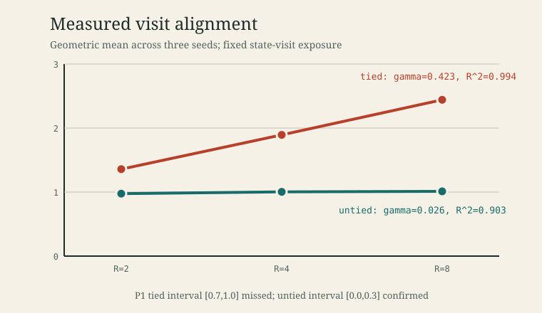

# Loop Schedule Algebra v0

## Result in one paragraph

Loop Schedule Algebra represents a recurrent architecture as
`A=(S,Phi,w,rho,g,sigma,pi)`, preserving parameter tying, state interfaces,
schedule nesting, gradient visibility, supervision, and carry. Its direct
visit-alignment probe cleanly separated tied from untied toy loops, but the
registered quantitative predictions did not all survive measurement. The
untied exponent and all three mask-ordering tests confirmed; the tied exponent
was `0.423`, below the registered `[0.7,1.0]`; and the predicted stability
boundary `p*=0.3557` did not transfer to either held-out cell because every
tested point was stable, left-censoring both boundaries at `p<=0.15`. The
campaign therefore supports the schedule measurement instrument and rejects
the claimed boundary transfer in this toy setting.



## Formal object

An instance is

```text
A = (S, Phi, w, rho, g, sigma, pi)
```

- `S` is the set of named state registers.
- `Phi` is the set of physical modules. Parameter identity belongs here, not
  in the unrolled word.
- `w` is a finite regular word formed by visit symbols, concatenation, and
  integer powers. Each symbol records its read set and write register.
- `rho_j=(alpha_j,beta_j)` is the residual parameterization for module `j`.
- `g` selects gradient-visible applications, including full, one-cycle,
  last-k, explicit, module-tail, and HRM-Text warmup masks.
- `sigma` identifies loss attachment visits.
- `pi` identifies persistent and detached carry registers.

For a module with `J_j` residual sublayers per application, the implemented
invariants are

```text
M(A)   = sum_i J_module(i)
M_g(A) = sum_{i in g} J_module(i)
R(j)   = number of forward visits to module j
R_g(j) = number of gradient-visible visits to module j
B(A)   = sum_j J_j R_g(j) kappa_g(j) (beta_j/alpha_j)^2
p*(A)  = (1 + max_j gamma_j) / 4
```

Parameter count sums physical modules once. FLOPs sum applications in the
expanded word. This distinction is the point of the algebra: tied compute can
grow without increasing parameter count, and gradient-visible compute can
differ from forward compute.

## Source extraction

Every implementation cell is represented in `lsa/instances.py` by a value and
either `VERIFIED(source, locator, SHA-256)` or `FILL`. This table is condensed;
the registry contains per-cell line locators.

| Instance | States and modules | Schedule and input | Gradient, supervision, carry | Residual form | Status |
|---|---|---|---|---|---|
| DeepLoop-GPT | stream; K tied blocks | `(B1...BK)^R`; stream init | full; final; no segment carry | registered DeepLoop scaling | VERIFIED(paper) |
| HRM official | `z_H,z_L`; distinct H/L stacks | `(L^L_cycles.H)^H_cycles`; input at every L | final L/H only; final `z_H` LM/Q; detached carry | unit residual additions plus RMSNorm | VERIFIED(source) |
| HRM-Text | `z_H,z_L`; distinct H/L stacks | `(L^L_cycles.H)^H_cycles`; `z_H:=x` only | H-prioritized `bp_steps`; final `z_H`; no carry | unit additions; config-dependent initialization | VERIFIED(source) |
| TRM official | `z_H,z_L`; one tied `L_level` stack for both roles | `(L_low^L_cycles.L_high)^H_cycles`; input at every low visit | final low/high only; final `z_H` LM/Q; detached carry | unit additions plus RMSNorm | VERIFIED(source) |
| Gym TRMProposer | encoded/hidden; one tied GRUCell | `GRU^recurrence_steps`; encoded input every visit | full when trained; final hidden to four heads; no carry | GRU gates, not alpha/beta residual form | VERIFIED(source) |
| Gym LDT | interval/product or powerset lattice | caller-defined symbolic refinement | no autograd or loss; caller retains state | parameter-free | VERIFIED(source), not kappa-measurable |
| Gym Hybrid TRM/LDT | neural hidden plus CandidateState | TRM recurrence then certification membrane | no single core gradient/supervision rule | GRU plus symbolic membrane | `g`,`sigma` remain FILL |

The official TRM row follows the pinned implementation rather than replacing
it with the paper's `{y,z}` notation. The gym TRM is separately named because
it is a GRU analogue, not that official implementation.

Source pins:

- DeepLoop: [arXiv:2607.13491](https://arxiv.org/abs/2607.13491).
- HRM: [sapientinc/HRM](https://github.com/sapientinc/HRM), commit `ac15626`,
  model SHA-256 `756631b3...74e92`.
- TRM: [SamsungSAILMontreal/TinyRecursiveModels](https://github.com/SamsungSAILMontreal/TinyRecursiveModels),
  commit `c011037`, model SHA-256 `05d37524...5b46`.
- HRM-Text local fork: commit `01ef01c`, schedule SHA-256
  `db73f328...a19`, Transformer SHA-256 `6515d23b...f4a`.
- Gym extraction base: commit `89a1f69`.

## HRM-Text correction

For `H_cycles=2`, `L_cycles=3`, and `bp_steps=5`, HRM-Text allocates

```text
H_bp_steps = min(2, 5-1) = 2
L_bp_steps = 5-2 = 3
```

Expanding `(L^3.H)^2` and taking module-specific tails gives exactly
`{L4,L5,L6,H1,H2}`, so `R_g(H)=2`. This identity is a unit test, not a prose
correspondence.

## Kappa probe

For every gradient-visible visit, the probe computes:

1. `U_r`, a top-direction JVP through the schedule suffix, using
   `torch.func.jvp`/`vjp` and five power iterations.
2. `G_r`, a recomputed loss gradient where only that application of the module
   has live parameters; all other applications use detached parameters through
   `torch.func.functional_call`.
3. The scale-free directional alignment

```text
kappa_g = ||sum_r U_r|| ||sum_r G_r||
          / (R_g max_r||U_r|| max_r||G_r||),       0 <= kappa_g <= R_g.
```

Residual scale is applied once in `B(A)`. The draft brief placed
`(beta/alpha)^2` in both the kappa denominator and `B`, while also defining
`C_U,C_G` as the observed maximum norms. That combination makes a one-visit
coefficient equal `1/(beta/alpha)^2`, contradicting `kappa in [0,R_g]`. The
first run exposed this at `kappa=16` for `R_g=1,beta=0.25`; it was invalidated
before prediction sealing, retained in full, and converted into a regression
test requiring one-visit kappa to equal one independent of residual scale.

## Registered protocol

- Toy: hidden size 128, two-linear-layer residual blocks, deterministic signed
  permutation regression, AdamW, batch 8.
- Progress: 4,096 state-visit exposures per cell, not a fixed optimizer-step
  count.
- Gamma cells: tied and visit-untied loops at `R={2,4,8}`, seeds
  `{101,103,107}`.
- P1: tied `gamma in [0.7,1.0]`; untied `gamma in [0.0,0.3]`.
- P3: at tied `R=8`, kappa is nondecreasing from one-step to last-4 to full.
- Estimator stop: any per-cell seed spread above 10x.
- Fit stop: any registered fit with `R^2<0.8`.
- P2 scaling: `alpha=1,beta=R^(-2p)` on held-out `R={6,12}`.
- P2 grid: `p=0.15,...,0.65` in 0.05 steps; a seed is stable iff its run is
  finite, maximum gradient norm is at most 100, and final/initial loss is at
  most 10. A cell is stable by two-of-three seed majority. The boundary is the
  lowest stable point with an entirely stable higher-p tail.

The config was frozen at SHA-256
`86bc4bf4e7c1480722c8b377e0ec028958010225d331a748e8917b8d433ff7f1`
before outcomes. The P2 prediction was separately sealed at commit `0febbd4`
with SHA-256 `fa8f23350a357a4b4a0ebe7d0c381147214755183465256dc82011c336613f28`
before the boundary run.

## Results

### P1: partial rejection

| Regime | kappa R=2 | kappa R=4 | kappa R=8 | gamma | R^2 | Registered outcome |
|---|---:|---:|---:|---:|---:|---|
| tied | 1.3580 | 1.8936 | 2.4407 | 0.4229 | 0.9940 | rejected: below 0.7 |
| untied | 0.9755 | 1.0037 | 1.0115 | 0.0261 | 0.9026 | confirmed |

### Post-v0.1 reconciliation

The tied `gamma=0.422909` above is the terminal 4,096-exposure fit on
`R={2,4,8}`. Loop Schedule Algebra v0.1 reproduces those three kappas exactly
under the same hidden size, batch size, learning rate, residual scaling, and
five-iteration fixed-direction probe. Its reported terminal `gamma=0.309485`
is a same-horizon refit after adding `R=16`, not a conflicting replication or a
different training time. A later sealed addendum further finds nonmonotonic
kappa at `R=32` and `R=64`, so neither exponent should be interpreted as a
global or time-invariant architectural constant.

Across-seed spread ranged from 1.004x to 1.092x, far below the 10x stop.
Both fits cleared the registered quality gate. Tying does increase visit
alignment, but not at the preregistered near-linear exponent in this toy.

### P3: confirmed in all seeds

| Seed | one-step, Rg=1 | last-4, Rg=4 | full, Rg=8 | Monotone |
|---:|---:|---:|---:|---|
| 101 | 1.0000 | 1.9068 | 2.3370 | yes |
| 103 | 1.0000 | 1.9049 | 2.3318 | yes |
| 107 | 1.0000 | 1.8890 | 2.3521 | yes |

The gradient mask is therefore not a bookkeeping detail: exposing additional
applications moved the tied module away from the one-visit baseline in every
seed.

### P2: rejected, boundary left-censored

The tied fit implied

```text
p* = (1 + 0.422909) / 4 = 0.355727.
```

All 66 held-out runs were stable. At the most aggressive tested scaling
(`p=0.15`), all three seeds were stable for both held-out cells. Maximum
gradient norms were 3.454 at `R=6` and 9.629 at `R=12`, both below 100; the
largest final/initial loss ratios were 0.399 and 0.334. Thus the machine rule
returns the lowest grid point, but the scientifically accurate statement is
that both empirical boundaries are left-censored at `p<=0.15`. Each differs
from the sealed prediction by at least 0.206, over four grid steps.

This is the registered headline: the DeepLoop-style threshold did not transfer
to these toy held-out cells. The campaign cannot distinguish whether the
failure comes from finite depth, the task, the optimizer, or a stability rule
that is too permissive because the grid never entered an unstable regime.

## Resources and integrity

- Gamma: 27 canonical rows, SHA-256
  `d614837dff4dc7fab220c69fb49d5ccc05b19da9a33f26be9247217fa9c3482d`.
- Boundary: 66 canonical rows, SHA-256
  `043bdc4963a8dd7d92d5f66c8ba72cacf4b52d594c1baae37acaa43a2333aef6`.
- Gamma resource peak: 890.016 MB RAM, 10.456 MB/s I/O.
- Boundary resource peak: 778.133 MB RAM, 12.553 MB/s I/O.
- Both phases used 2,048 MB process-memory and 50% CPU Job Object hard caps,
  sustained-I/O abort monitoring, and a 1,800-second timeout.
- Both wrappers completed without an abort or lingering owned process. The
  post-run audit found no GPU compute app, no suspect training process, and no
  lingering owned PID.
- Checkpoints remain in the local experiment directory and are intentionally
  ignored by Git; records, results, event logs, receipts, predictions, and
  reports are committed.

## Limits

This is one synthetic regression family, three seeds, and three points per
gamma fit. The official HRM/TRM rows are source extraction, not measurements
of those full models. LDT is symbolic and has no kappa without a separately
defined differentiable surrogate. The p-sweep produced no unstable point, so
it localizes no boundary and should not be used to tune a model.

No prediction about task accuracy, sample efficiency, or reasoning quality anywhere in the campaign; the algebra prognosticates trainability boundaries and cost only.
