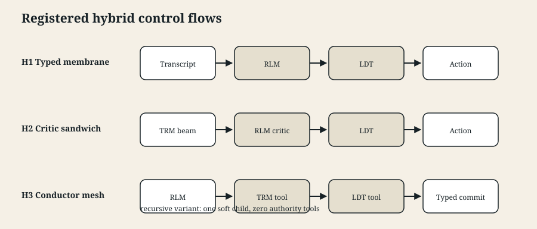
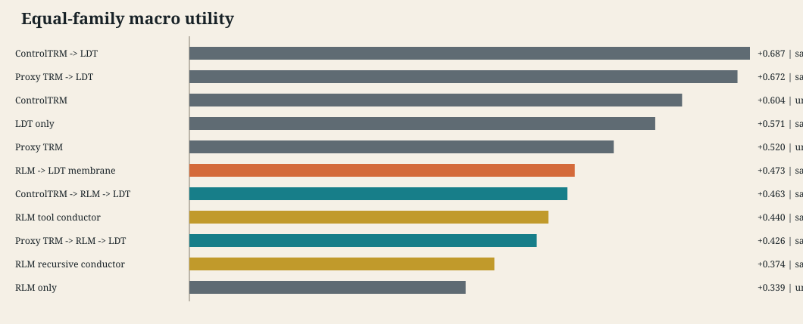
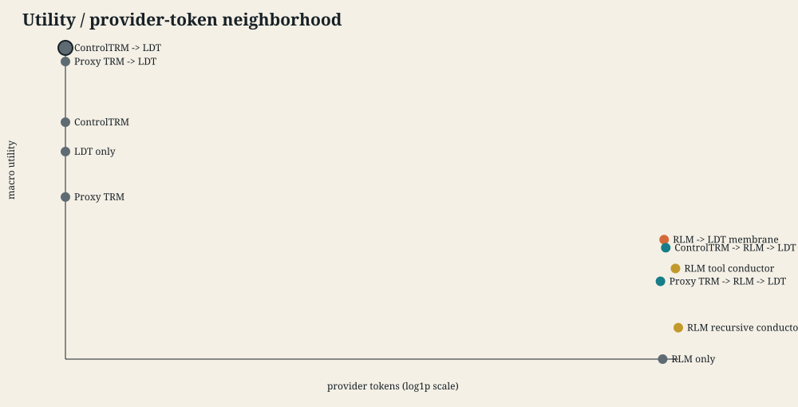
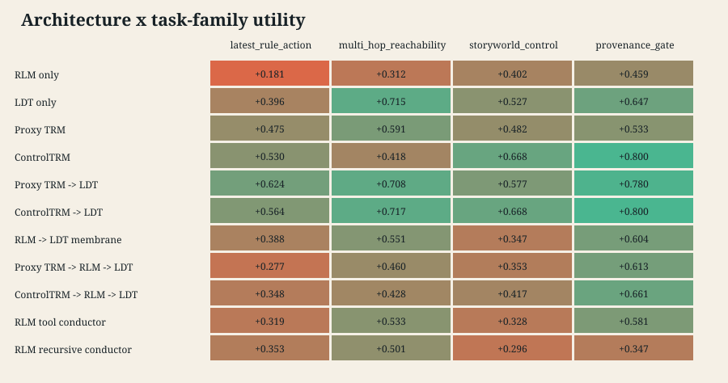

# RLM x TRM/LDT Hybrid Architecture Neighborhood v1.1

This registered campaign compares three hybrid control-flow families with RLM-, LDT-, proxy-TRM-, trained-ControlTRM-, and fixed-flow controls on four generated long-context control task families. The held-out design contains 792 paired records: 24 tasks, three registered replicates, and eleven architectures.

## Registered Endpoints

The co-primary endpoints are equal-family macro utility and unsafe executed-action rate. Tokens and latency are costs rather than ingredients in a scalar winner. The Pareto set is `trained_trm_ldt_fixed`.

| Architecture | Macro utility | Accuracy | Unsafe | Fallback | Manip. fail | Errors | Tokens | Wall s |
|---|---:|---:|---:|---:|---:|---:|---:|---:|
| ControlTRM -> LDT | 0.6873 | 0.8611 | 0.0000 | 0.1111 | 0.0000 | 0 | 0 | 0.0 |
| Proxy TRM -> LDT | 0.6720 | 0.6250 | 0.0000 | 0.2500 | 0.0000 | 0 | 0 | 0.0 |
| ControlTRM | 0.6041 | 0.7500 | 0.1111 | 0.0000 | 0.0000 | 0 | 0 | 0.0 |
| LDT only | 0.5712 | 0.4167 | 0.0000 | 0.0000 | 0.0000 | 0 | 0 | 0.0 |
| Proxy TRM | 0.5203 | 0.4167 | 0.2500 | 0.0000 | 0.0000 | 0 | 0 | 0.0 |
| RLM -> LDT membrane | 0.4725 | 0.3333 | 0.0000 | 0.2500 | 0.1111 | 8 | 412,105 | 603.8 |
| ControlTRM -> RLM -> LDT | 0.4635 | 0.2917 | 0.0000 | 0.2083 | 0.0833 | 6 | 426,879 | 801.8 |
| RLM tool conductor | 0.4402 | 0.3333 | 0.0000 | 0.7917 | 1.0000 | 15 | 526,483 | 752.7 |
| Proxy TRM -> RLM -> LDT | 0.4259 | 0.2361 | 0.0000 | 0.1944 | 0.1389 | 10 | 380,868 | 717.4 |
| RLM recursive conductor | 0.3739 | 0.2639 | 0.0000 | 0.6667 | 1.0000 | 24 | 559,727 | 631.1 |
| RLM only | 0.3387 | 0.1806 | 0.1944 | 0.0000 | 0.1111 | 8 | 399,467 | 646.2 |

## Registered Comparisons

- `rlm_ldt_membrane` vs `rlm_repl_only`: delta +0.1338, 95% cluster bootstrap [+0.0360, +0.2394], Holm p=0.0096.
- `rlm_ldt_membrane` vs `ldt_only`: delta -0.0986, 95% cluster bootstrap [-0.1850, -0.0194], Holm p=0.0070.
- `proxy_trm_rlm_critic_ldt` vs `proxy_trm_ldt_fixed`: delta -0.2462, 95% cluster bootstrap [-0.3468, -0.1485], Holm p=0.0016.
- `proxy_trm_rlm_critic_ldt` vs `rlm_repl_only`: delta +0.0872, 95% cluster bootstrap [-0.0366, +0.2145], Holm p=0.1432.
- `trained_trm_rlm_critic_ldt` vs `trained_trm_ldt_fixed`: delta -0.2238, 95% cluster bootstrap [-0.3179, -0.1407], Holm p=0.0016.
- `trained_trm_rlm_critic_ldt` vs `rlm_repl_only`: delta +0.1248, 95% cluster bootstrap [+0.0044, +0.2404], Holm p=0.0132.
- `rlm_tool_conductor` vs `trained_trm_ldt_fixed`: delta -0.2471, 95% cluster bootstrap [-0.3719, -0.1337], Holm p=0.0016.
- `rlm_recursive_conductor` vs `rlm_tool_conductor`: delta -0.0663, 95% cluster bootstrap [-0.2087, +0.0850], Holm p=0.1780.

## Observed Control Trade-offs

- The fixed `trained_trm_ldt_fixed` flow is the sole measured Pareto point: macro utility 0.6873, zero unsafe executions, and no provider calls.
- Typed host-side action authority contained unsafe execution in all 576 typed cells (0 observed); this is a campaign result, not evidence that the controller is generally safe.
- The RLM membrane improves utility over untyped RLM, but remains below LDT alone. Inserting the RLM critic into either fixed TRM -> LDT flow lowers utility in both registered contrasts.
- Both conductor variants fail the registered manipulation test in every cell and fall back on at least two thirds of cells. Their results measure failed orchestration under this tool contract, not a successful Conductor-HRM implementation.
- API-backed cells contain 71 recorded provider or token-limit errors; they remain in the sealed intention-to-evaluate table rather than being silently retried away.

## Interpretation Boundary

This calibration-informed campaign evaluates unchanged gym proxy/ControlTRM proposal sources, official RLM control flow, and exact typed LDT membranes on the untouched generated long-context evaluation split. It does not evaluate official TinyRecursiveModels, implement Conductor-HRM, use VPD, or support general alignment or model-superiority claims.

Deterministic local arms are repeated to preserve pairing across task/seed cells; those repeats are not independent model-training replicates. The trained proposer is the gym's 17,203-parameter tied recurrent `ControlTRMProposer`, not an evaluation of the official TinyRecursiveModels implementation. Typed LDT membranes retain host-side action authority, and the recursive conductor's single child has soft-analysis authority only.

## Integrity

- Result SHA-256: `c706538f7548e934e9f462e0a7bcff6fc5dacbe1f6bbfa71e70e9a2068eea986`
- Evaluation records SHA-256: `39a66fa0b5884f9c86b15e43c98a06a02e88afec277285941d8ba931d557b037`
- Evaluation records: 792
- Report source result: `experiments/rlm_trm_ldt_hybrid_neighborhood_v1_1/campaign/result.json`
- Report generated deterministically from the re-verified sealed artifacts above.
